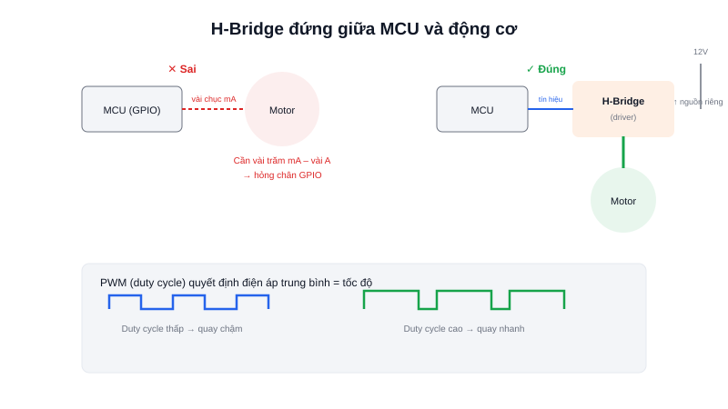

Động cơ DC (DC motor) là loại động cơ điện đơn giản và rẻ nhất — cấp điện một chiều là quay, đảo cực tính là đảo chiều quay. Đây thường là lựa chọn đầu tiên khi làm bánh xe cho một robot di động. Nhưng có một hiểu lầm rất phổ biến ở người mới: nghĩ rằng có thể nối động cơ thẳng vào chân GPIO của vi điều khiển giống như nối một chiếc LED.



## Khái niệm chính

Bên trong một động cơ DC có cuộn dây và nam châm — khi dòng điện chạy qua cuộn dây, nó tạo ra từ trường tương tác với nam châm, sinh ra lực làm trục quay. Muốn quay nhanh hơn, cần dòng điện hoặc điện áp lớn hơn; muốn đảo chiều, cần đảo chiều dòng điện.

Vấn đề là một chân GPIO của MCU chỉ cung cấp được vài chục miliampe (mA), trong khi một động cơ DC nhỏ đã cần vài trăm mA tới vài ampe khi khởi động hoặc có tải — nối trực tiếp gần như chắc chắn sẽ làm hỏng chân GPIO hoặc cả chip.

### H-bridge — mạch cầu H giải quyết cả hai vấn đề

Một mạch **driver động cơ** (thường dùng cấu hình **H-bridge**, gồm 4 transistor/MOSFET xếp hình chữ H quanh động cơ) đứng giữa MCU và động cơ, giải quyết đồng thời hai việc:
- **Khuếch đại dòng điện** — MCU chỉ cần gửi tín hiệu điều khiển dòng nhỏ, H-bridge cấp dòng lớn thực tế cho động cơ từ một nguồn riêng
- **Đảo chiều quay** — bằng cách bật cặp transistor chéo nhau trong hình chữ H, dòng điện qua động cơ đảo chiều mà MCU không cần đảo cực nguồn

> **Tóm lại:** MCU không bao giờ "chạy" động cơ trực tiếp — nó chỉ gửi tín hiệu điều khiển (mức logic + PWM) tới driver, driver mới là thứ thực sự cấp dòng lớn cho động cơ từ nguồn riêng.

## Nguyên lý hoạt động

```text
MCU (tín hiệu điều khiển, dòng nhỏ)
   │  IN1, IN2, PWM
   ▼
H-Bridge Driver (VD: L298N, TB6612)  ◄── Nguồn động cơ riêng (VD: 12V)
   │  dòng lớn, có thể đảo chiều
   ▼
Động cơ DC quay
```

Tốc độ quay được điều khiển bằng **PWM (Pulse Width Modulation)** — thay vì cấp điện áp cố định, MCU bật/tắt tín hiệu điều khiển rất nhanh (hàng nghìn lần/giây), tỷ lệ thời gian "bật" trên tổng chu kỳ (**duty cycle**) quyết định điện áp trung bình thực tế đặt lên động cơ:

```c
// Duty cycle 75% → tốc độ khoảng 75% tốc độ tối đa
__HAL_TIM_SET_COMPARE(&htim3, TIM_CHANNEL_1, 750); // thang 0-1000
HAL_GPIO_WritePin(IN1_Port, IN1_Pin, GPIO_PIN_SET);   // Chiều quay thuận
HAL_GPIO_WritePin(IN2_Port, IN2_Pin, GPIO_PIN_RESET);
```

Điều khiển bằng PWM thuần (open-loop, không có phản hồi) không đảm bảo tốc độ thực tế ổn định khi tải thay đổi — muốn biết chính xác tốc độ thực và giữ nó ổn định, cần thêm một **encoder** để đo tốc độ thật, kết hợp vòng điều khiển **PID** — chủ đề của hai bài tiếp theo.
