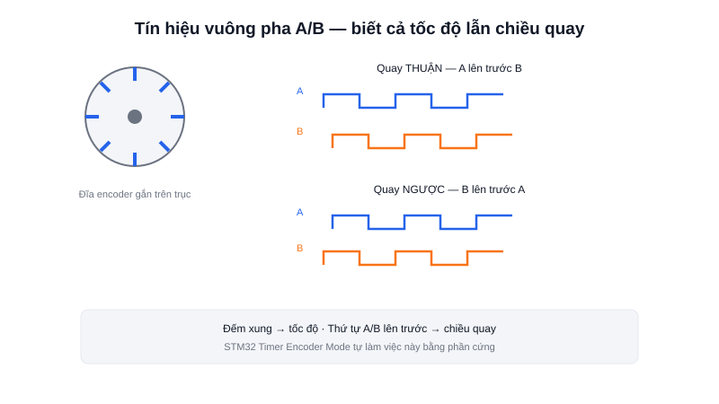

Đặt cùng một giá trị PWM cho động cơ khi robot chạy trên sàn phẳng và khi leo dốc, tốc độ quay thực tế sẽ khác nhau — PWM chỉ điều khiển điện áp trung bình đặt vào động cơ, không đảm bảo tốc độ quay thực tế. Muốn biết chính xác động cơ đang quay bao nhiêu vòng/giây, hoặc trục đã quay được bao nhiêu độ, cần một cảm biến riêng: **encoder**.



## Khái niệm chính

Encoder gắn trực tiếp vào trục động cơ (hoặc trục bánh xe), phát ra tín hiệu xung mỗi khi trục quay được một góc nhỏ cố định. Đếm số xung trong một khoảng thời gian cho biết **tốc độ quay**; đếm dồn tổng số xung cho biết **đã quay được bao nhiêu** so với vị trí ban đầu.

Có hai loại chính:
- **Encoder tương đối (incremental)** — chỉ biết đã quay bao nhiêu **kể từ lúc bật nguồn**, mất điện là mất luôn vị trí tham chiếu, phổ biến và rẻ hơn
- **Encoder tuyệt đối (absolute)** — luôn biết chính xác góc quay hiện tại kể cả vừa mất điện, phức tạp và đắt hơn

### Hai kênh A/B — biết cả tốc độ lẫn chiều quay

Hầu hết encoder tương đối dùng trong robot có **2 kênh tín hiệu (A và B)**, đặt lệch pha nhau 90°. Chỉ đếm xung trên 1 kênh cho biết tốc độ nhưng không biết chiều quay; so sánh **thứ tự** kênh nào lên mức cao trước (A trước B, hay B trước A) sẽ cho biết trục đang quay thuận hay ngược — kỹ thuật gọi là **giải mã cầu phương (quadrature decoding)**.

> **Tóm lại:** Encoder là "đôi mắt" của vòng điều khiển động cơ — không có nó, MCU chỉ biết mình *đã ra lệnh* quay bao nhiêu, chứ không biết động cơ *thực sự* đang quay bao nhiêu.

## Nguyên lý hoạt động

```text
Kênh A: ┐  ┌──┐  ┌──┐  ┌──┐          (quay thuận: A lên trước B)
        └──┘  └──┘  └──┘  └──
Kênh B:   ┐  ┌──┐  ┌──┐  ┌──┐
          └──┘  └──┘  └──┘  └──
```

Nhiều dòng MCU (như STM32) có chế độ **Timer Encoder Mode** — phần cứng Timer tự động đếm và giải mã cầu phương mà không tốn CPU xử lý từng xung ngắt:

```c
// Bật Timer ở chế độ encoder — phần cứng tự đếm, tự nhận biết chiều quay
HAL_TIM_Encoder_Start(&htim2, TIM_CHANNEL_ALL);

int32_t count = __HAL_TIM_GET_COUNTER(&htim2);
// count tăng khi quay thuận, giảm khi quay ngược — không cần code xử lý ngắt
```

Số xung trên mỗi vòng quay được gọi là **độ phân giải (PPR/CPR — Pulse/Count Per Revolution)** — encoder có độ phân giải càng cao, đo được góc quay càng chính xác. Trong một AMR, dữ liệu encoder của cả bánh trái và bánh phải chính là đầu vào cơ bản nhất để tính **odometry** (ước lượng vị trí robot đã di chuyển) và là tín hiệu phản hồi bắt buộc cho vòng điều khiển **PID** giữ tốc độ động cơ ổn định — chủ đề hai bài tiếp theo.
