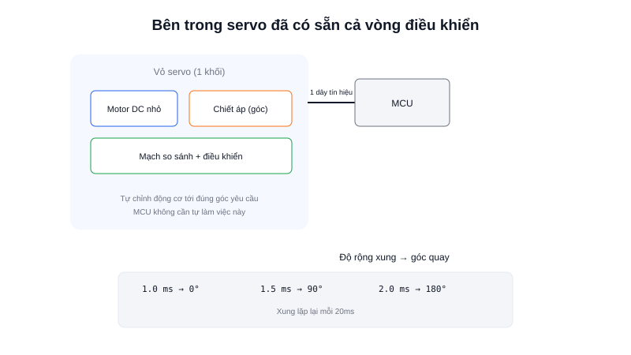

Động cơ DC thường cần thêm driver (H-bridge) và encoder rời nếu muốn điều khiển vị trí chính xác. **Servo motor** (thường gọi tắt là "servo", loại phổ biến trong mô hình RC) giải quyết gọn cả hai việc đó ngay bên trong vỏ động cơ — chỉ cần một dây tín hiệu duy nhất để ra lệnh "quay tới góc này".



## Khái niệm chính

Một servo hobby tiêu chuẩn có 3 dây: **nguồn (+)**, **GND (-)**, và **tín hiệu điều khiển**. Bên trong vỏ nhựa nhỏ gọn đã tích hợp sẵn: một động cơ DC nhỏ, bộ bánh răng giảm tốc, một **chiết áp (potentiometer)** đo góc quay trục hiện tại, và một mạch điều khiển nhỏ tự so sánh góc mong muốn với góc đo được rồi tự chỉnh động cơ — nói cách khác, **vòng điều khiển vị trí đã nằm sẵn bên trong servo**, MCU không cần tự làm việc đó.

### Điều khiển bằng độ rộng xung PWM

Servo hobby tiêu chuẩn nhận lệnh qua độ rộng của một xung PWM lặp lại mỗi 20ms:

| Độ rộng xung | Góc quay |
|---|---|
| 1.0 ms | 0° |
| 1.5 ms | 90° (giữa) |
| 2.0 ms | 180° |

Servo loại thường chỉ quay trong phạm vi giới hạn (thường 0°-180°), khác với **continuous rotation servo** (servo quay liên tục) — biến thể đã tháo bỏ giới hạn cơ khí, dùng độ rộng xung để điều khiển **tốc độ và chiều quay** thay vì góc, hoạt động giống động cơ DC có sẵn driver hơn là servo vị trí thông thường.

> **Tóm lại:** Servo = động cơ + encoder (chiết áp) + driver + vòng điều khiển vị trí, đóng gói sẵn trong một khối — đổi lại sự tiện lợi (chỉ 1 dây tín hiệu) để lấy giới hạn về công suất và độ chính xác so với việc tự ráp DC motor + encoder + PID.

## Nguyên lý hoạt động

```text
MCU tạo xung PWM (chu kỳ 20ms, độ rộng 1-2ms)
        ↓
Mạch điều khiển bên trong servo đọc độ rộng xung
        ↓
So sánh với góc hiện tại (đọc từ chiết áp nội bộ)
        ↓
Tự động chỉnh động cơ nội bộ quay tới đúng góc yêu cầu
```

Tạo tín hiệu điều khiển servo bằng thư viện Arduino:

```cpp
#include <Servo.h>

Servo myServo;

void setup() {
  myServo.attach(9);   // Chân tín hiệu
}

void loop() {
  myServo.write(90);   // Ra lệnh quay tới góc 90° — thư viện tự tạo đúng xung PWM
}
```

Trong robot, servo hobby thường dùng cho các khớp cần vị trí chính xác nhưng công suất không quá lớn — cơ cấu lái (steering) của xe mô hình, cánh tay gắp nhỏ, hay xoay giá đỡ cảm biến — trong khi việc kéo bánh xe di chuyển cả robot (cần công suất lớn, quay liên tục) vẫn là công việc của DC motor kết hợp encoder và driver rời.
