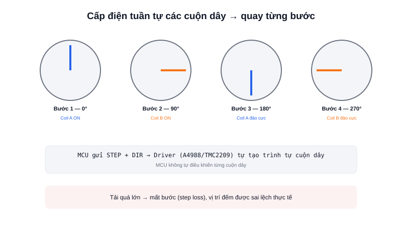

DC motor quay liên tục, muốn biết vị trí chính xác phải gắn thêm encoder. **Stepper motor** (động cơ bước) đi theo hướng ngược lại: động cơ chỉ quay theo từng **bước rời rạc** cố định mỗi khi nhận một xung điều khiển — nếu đếm đúng số xung đã gửi, về lý thuyết luôn biết chính xác vị trí trục mà không cần cảm biến phản hồi nào.



## Khái niệm chính

Bên trong stepper có nhiều cặp cuộn dây (coil) bố trí quanh trục, mỗi cặp khi được cấp điện tạo ra một từ trường kéo rotor dừng ở đúng một vị trí góc cố định. Bằng cách cấp điện tuần tự cho các cặp cuộn dây theo đúng trình tự, rotor bị "kéo" quay từng bước nhỏ — một động cơ bước phổ biến có thể có 200 bước cho mỗi vòng quay (tức mỗi bước = 1.8°).

### Full step, half step, và microstepping

- **Full step** — cấp điện đúng trình tự cơ bản, mỗi lần chuyển bước là một bước đầy đủ (VD: 1.8°)
- **Half step** — xen kẽ cấp điện 1 cuộn và 2 cuộn cùng lúc, tăng gấp đôi số bước, chuyển động mượt hơn
- **Microstepping** — điều chỉnh dòng điện qua từng cuộn theo dạng sóng sin thay vì bật/tắt hoàn toàn, chia mỗi bước cơ khí thành hàng chục "vi bước" ảo, chuyển động cực mượt và êm, nhưng cần driver chuyên dụng hỗ trợ (VD: TMC2209)

> **Tóm lại:** Stepper cho phép định vị chính xác theo kiểu open-loop (không cần cảm biến phản hồi) — miễn là không yêu cầu momen xoắn vượt quá khả năng động cơ ở tốc độ đang chạy, nếu không rotor sẽ "trượt" khỏi từ trường đang kéo nó, gọi là **mất bước (step loss)**, và vị trí đếm được trên MCU sẽ sai lệch so với vị trí thật mà không có cách nào tự phát hiện nếu không có encoder bổ sung.

## Nguyên lý hoạt động

Trình tự cấp điện cơ bản cho stepper 4 cuộn dây (bipolar, full step):

```text
Bước 1:  Coil A ON,  Coil B OFF  → rotor dừng ở 0°
Bước 2:  Coil A OFF, Coil B ON   → rotor dừng ở 90°
Bước 3:  Coil A ON (đảo cực),   Coil B OFF → rotor dừng ở 180°
Bước 4:  Coil A OFF, Coil B ON (đảo cực)  → rotor dừng ở 270°
```

Trong thực tế, MCU không tự tạo trình tự này thủ công cho từng cuộn dây — luôn đi qua một **driver chuyên dụng** (A4988, DRV8825, TMC2209...), MCU chỉ cần gửi 2 tín hiệu đơn giản: **STEP** (mỗi xung = 1 bước) và **DIR** (chiều quay):

```c
HAL_GPIO_WritePin(DIR_Port, DIR_Pin, GPIO_PIN_SET); // Chọn chiều quay

for (int i = 0; i < 200; i++) {   // 200 xung = 1 vòng quay đầy đủ (full step)
    HAL_GPIO_WritePin(STEP_Port, STEP_Pin, GPIO_PIN_SET);
    delay_us(500);
    HAL_GPIO_WritePin(STEP_Port, STEP_Pin, GPIO_PIN_RESET);
    delay_us(500);
}
```

Stepper phổ biến trong máy in 3D, máy CNC, và các trục định vị chính xác trong robot công nghiệp — nơi tải trọng có thể tính toán trước và ổn định. Với bánh xe di chuyển của một AMR (tải thay đổi liên tục, cần phản hồi tốc độ thực), DC motor kết hợp encoder và PID vẫn là lựa chọn phù hợp hơn.
