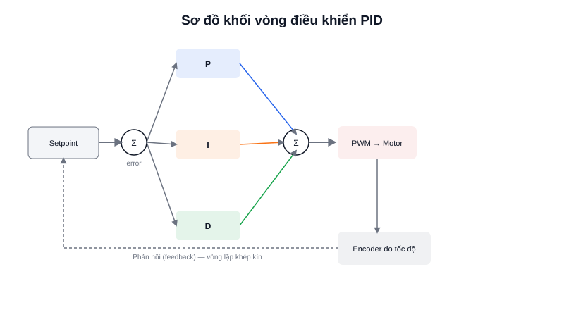

Biết tốc độ động cơ hiện tại (nhờ encoder) là chưa đủ — cần một bộ điều khiển tự động **quyết định phải điều chỉnh PWM bao nhiêu** để tốc độ thực tế tiến sát tốc độ mong muốn, kể cả khi tải thay đổi liên tục. **PID (Proportional–Integral–Derivative)** là bộ điều khiển kinh điển và phổ biến nhất cho bài toán này — đơn giản để hiểu, hiệu quả trong hầu hết ứng dụng thực tế.



## Khái niệm chính

Ý tưởng cốt lõi của mọi vòng điều khiển: liên tục tính **sai số (error)** giữa giá trị mong muốn (**setpoint**) và giá trị đo được thực tế, rồi dùng sai số đó để quyết định tín hiệu điều khiển tiếp theo.

```text
error = setpoint - giá_trị_đo_được
```

PID kết hợp ba thành phần, mỗi thành phần phản ứng với sai số theo một cách khác nhau:

- **P (Proportional)** — tỷ lệ thuận với sai số hiện tại: sai số càng lớn, phản ứng càng mạnh. Đơn giản nhưng dùng một mình thường để lại **sai số dư (steady-state error)** — không bao giờ về đúng chính xác setpoint.
- **I (Integral)** — cộng dồn sai số theo thời gian: nếu sai số nhỏ nhưng kéo dài (P một mình không đủ mạnh để triệt tiêu hẳn), phần I sẽ tích luỹ dần và đẩy hệ thống tới đúng setpoint.
- **D (Derivative)** — phản ứng theo **tốc độ thay đổi** của sai số: nếu sai số đang giảm rất nhanh (sắp vọt qua setpoint), D sẽ "phanh" bớt để tránh dao động quá đà (overshoot).

> **Tóm lại:** P kéo nhanh về đích nhưng để lại sai số dư · I triệt tiêu sai số dư nhưng phản ứng chậm và dễ gây dao động nếu quá mạnh · D làm mượt, chống vọt lố nhưng nhạy với nhiễu đo lường.

## Nguyên lý hoạt động

```text
setpoint ──►(+)          ┌─── P: Kp × error ───┐
              │ error     │                     │
đo được ──►(-)┴──────────►├─── I: Ki × Σerror ──┼──► (+) ──► PWM ──► Động cơ
                           │                     │                    │
                           └─── D: Kd × Δerror ──┘                    │
                                                                       │
                    ◄──────────── Encoder đo tốc độ thực ─────────────┘
```

Công thức tính đầu ra PID mỗi chu kỳ (thường chạy trong ngắt Timer, tần số cố định như 100Hz hoặc 1kHz):

```c
float error = setpoint - measured_speed;
integral += error * dt;
float derivative = (error - previous_error) / dt;

float output = Kp * error + Ki * integral + Kd * derivative;
previous_error = error;

set_motor_pwm(output);  // Áp giá trị vừa tính ra động cơ
```

Ba hằng số **Kp, Ki, Kd** phải được **chỉnh (tuning)** cho từng hệ thống cụ thể — không có bộ số chung cho mọi động cơ. Cách chỉnh phổ biến nhất là tăng dần Kp cho tới khi hệ thống dao động nhẹ, giảm lại một chút, rồi thêm Ki để triệt tiêu sai số dư, cuối cùng thêm Kd nếu cần giảm dao động — quá trình này thường mất nhiều lần thử-sai trên phần cứng thật, vì mô phỏng lý thuyết hiếm khi khớp hoàn toàn với ma sát và quán tính thực tế của động cơ.
