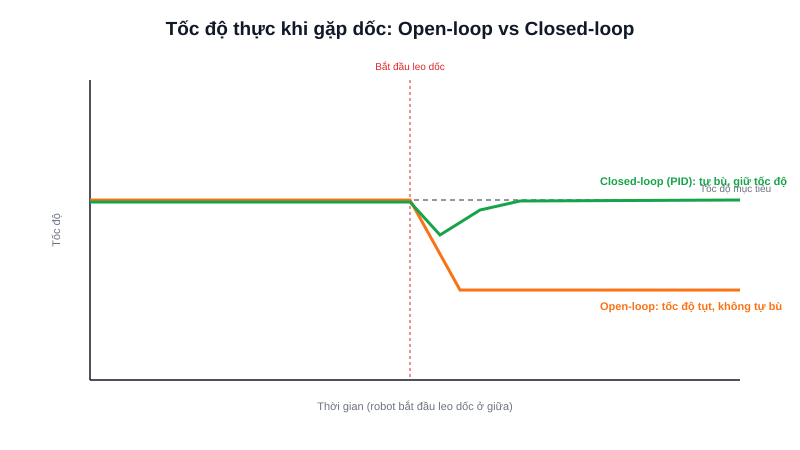

Ba bài trước đã tách riêng từng mảnh: DC motor cần driver để chạy, encoder đo được tốc độ thực, PID biết cách tính toán điều chỉnh dựa trên sai số. Bài này ghép cả ba lại thành một vòng điều khiển tốc độ hoàn chỉnh — thứ nằm ở lõi của mọi bánh xe AMR di chuyển ổn định.



## Khái niệm chính

Có hai cách điều khiển tốc độ động cơ, khác nhau ở một điểm duy nhất: **có dùng phản hồi (feedback) hay không**.

### Open-loop — chỉ đặt PWM, không kiểm tra kết quả

Cách đơn giản nhất: quyết định một giá trị PWM cố định tương ứng với "tốc độ mong muốn", gửi thẳng cho driver, và tin rằng động cơ sẽ quay đúng tốc độ đó.

```c
set_motor_pwm(600);  // "Hy vọng" động cơ quay khoảng 60% tốc độ tối đa
```

Vấn đề: tốc độ quay thực tế phụ thuộc cả vào **điện áp pin** (giảm dần khi pin yếu) và **tải** (robot leo dốc hay chạy trên sàn phẳng) — cùng một giá trị PWM, tốc độ thực tế sẽ khác nhau tuỳ điều kiện. Open-loop chấp nhận sự thiếu chính xác này để đổi lấy sự đơn giản.

### Closed-loop — đo tốc độ thật, tự điều chỉnh liên tục

Cách chính xác hơn: dùng encoder đo tốc độ thực tế, đưa vào PID để tự động tính lại giá trị PWM mỗi chu kỳ, sao cho tốc độ đo được luôn bám sát tốc độ mong muốn — bất kể tải hay điện áp pin thay đổi ra sao.

> **Tóm lại:** Open-loop rẻ và đơn giản, chấp nhận sai số theo tải · Closed-loop (encoder + PID) phức tạp hơn một chút nhưng giữ tốc độ ổn định thực sự — gần như bắt buộc cho bánh xe AMR, nơi tải trọng và độ dốc sàn nhà thay đổi liên tục trong lúc vận hành.

## Nguyên lý hoạt động

Vòng lặp điều khiển tốc độ hoàn chỉnh, chạy định kỳ trong ngắt Timer (ví dụ mỗi 10ms = 100Hz):

```c
void speed_control_loop(void) {  // Gọi định kỳ trong ngắt Timer
    int32_t pulses = __HAL_TIM_GET_COUNTER(&htim2);
    __HAL_TIM_SET_COUNTER(&htim2, 0);            // Đọc & reset bộ đếm encoder

    float measured_speed = pulses_to_rpm(pulses); // Quy đổi số xung → vòng/phút

    float error = target_speed - measured_speed;
    integral += error * DT;
    float derivative = (error - prev_error) / DT;

    float pwm = Kp * error + Ki * integral + Kd * derivative;
    pwm = constrain(pwm, -1000, 1000);            // Giới hạn trong dải PWM hợp lệ

    set_motor_pwm(pwm);
    prev_error = error;
}
```

```text
Sàn phẳng, tải nhẹ:   PWM ổn định ở mức thấp để giữ đúng tốc độ mục tiêu
Leo dốc, tải nặng:    PID tự động TĂNG PWM để bù lại, tốc độ vẫn giữ ổn định
Xuống dốc:            PID tự động GIẢM PWM, tránh vọt tốc độ
```

Trong một AMR hai bánh vi sai (differential drive), mỗi bánh có một vòng điều khiển tốc độ closed-loop độc lập như trên — đầu ra của lớp điều hướng cấp cao hơn (ví dụ Nav2) chỉ cần gửi xuống "tốc độ mong muốn của bánh trái/phải", còn việc giữ đúng tốc độ đó bất kể điều kiện thực tế là trách nhiệm của vòng PID chạy ngay trên STM32 ở tầng thấp — đúng như kiến trúc phân tầng đã nhắc tới trong bài so sánh các loại MCU.
