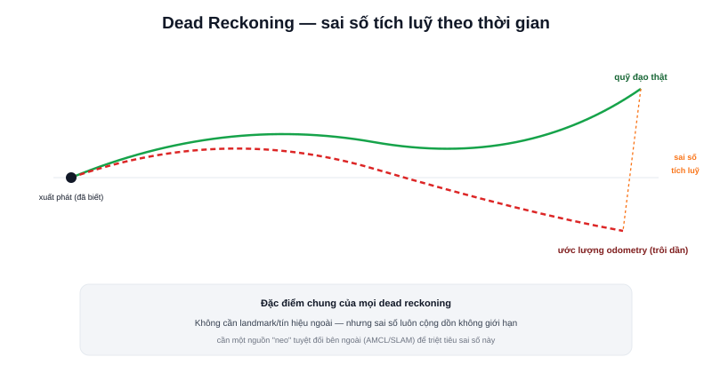

Bài [Differential Drive và Odometry](/blog/dong-hoc-robot-di-chuyen-differential-drive-odometry) đã trình bày chi tiết công thức tính odometry từ tốc độ bánh xe. Đây là chuyên mục **Localization** — nơi câu hỏi trọng tâm không phải "công thức tính thế nào" mà là "robot dùng gì để biết mình đang ở đâu, và tại sao chỉ một nguồn thông tin thường không đủ".



## Odometry là một dạng của Dead Reckoning

**Dead reckoning** là thuật ngữ hàng hải cổ — ước lượng vị trí hiện tại dựa trên vị trí đã biết trước đó, cộng với hướng đi và quãng đường đã di chuyển, **không cần quan sát bất kỳ điểm mốc (landmark) cố định nào bên ngoài**. Odometry (dùng encoder bánh xe) là một dạng dead reckoning điển hình trong robot di động — cùng họ với việc thuỷ thủ xưa ước lượng vị trí tàu chỉ từ tốc độ và la bàn, không cần nhìn thấy đất liền.

```text
vị_trí_mới = vị_trí_cũ + (khoảng cách đã di chuyển, theo hướng đã đi)
```

## Điểm mạnh: không cần gì ngoài bản thân robot

Dead reckoning nói chung, và odometry nói riêng, có một ưu điểm lớn: **hoạt động độc lập hoàn toàn**, không cần bản đồ có sẵn, không cần landmark, không cần tín hiệu bên ngoài (như GPS) — chỉ cần cảm biến gắn ngay trên robot (encoder). Đây là lý do odometry luôn là nguồn dữ liệu vị trí "sẵn có ngay từ giây đầu tiên", trước cả khi SLAM/AMCL kịp khởi tạo bản đồ hay hội tụ vị trí.

## Điểm yếu chí mạng: mọi dead reckoning đều trôi theo thời gian

Vì mỗi bước ước lượng đều dựa trên bước trước đó (tích luỹ), sai số nhỏ ở mỗi bước **cộng dồn không giới hạn** theo thời gian — không có cơ chế nội tại nào tự triệt tiêu sai số này. Đặc điểm này không riêng gì odometry bánh xe — mọi hệ dead reckoning (kể cả dùng IMU thuần, bài tiếp theo) đều mắc chung vấn đề, chỉ khác tốc độ trôi nhanh hay chậm.

> **Tóm lại:** Dead reckoning trả lời tốt câu hỏi "tôi vừa di chuyển bao xa" trong thời gian ngắn, nhưng **không bao giờ** có thể tự sửa sai lệch tích luỹ — vì nó không có cách nào đối chiếu với một điểm tham chiếu tuyệt đối bên ngoài. Đây chính là lý do localization thực tế luôn cần thêm một nguồn "neo" tuyệt đối.

## Localization thực tế = Dead Reckoning + Neo tuyệt đối

```text
Odometry/IMU (dead reckoning) → mượt, tần số cao, trôi dần theo thời gian
      +
AMCL/SLAM (đối chiếu bản đồ)  → chính xác dài hạn, cập nhật thưa hơn
      =
Ước lượng vị trí đáng tin cậy cho cả ngắn hạn lẫn dài hạn
```

Đây chính là vai trò của hệ toạ độ `map` và `odom` tách riêng đã nói ở bài [Hệ toạ độ trong Robot](/blog/he-toa-do-trong-robot) — `odom` là kết quả thuần dead reckoning (trôi dần), `map` là kết quả sau khi neo lại bằng AMCL (bài cuối chuyên mục này). Bài tiếp theo sẽ giới thiệu IMU — nguồn dead reckoning thứ hai, thường được kết hợp cùng odometry bánh xe qua kỹ thuật sensor fusion để giảm bớt (không loại bỏ hoàn toàn) tốc độ trôi.
