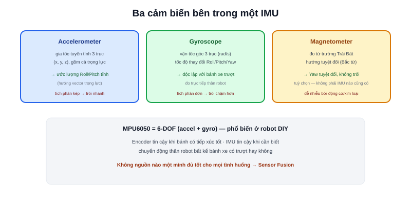

Bài [Odometry trong Localization](/blog/odometry-trong-localization) đã chỉ ra điểm yếu của odometry bánh xe: nếu bánh trượt trên sàn (mặt trơn, tăng/giảm tốc gấp), encoder vẫn đếm đủ số vòng quay nhưng robot **không thực sự di chuyển đúng như vậy** — encoder không có cách nào tự phát hiện việc này. **IMU (Inertial Measurement Unit)** giải quyết đúng điểm mù đó bằng cách đo trực tiếp chuyển động của thân robot, không thông qua bánh xe.

## Ba cảm biến bên trong một IMU

- **Accelerometer (gia tốc kế)** — đo gia tốc tuyến tính theo 3 trục (x, y, z), bao gồm cả gia tốc trọng trường — đây cũng là cách IMU có thể ước lượng góc nghiêng (roll, pitch) tĩnh: khi robot đứng yên, vector gia tốc đo được chủ yếu là trọng lực, hướng của vector đó cho biết robot đang nghiêng bao nhiêu
- **Gyroscope (con quay hồi chuyển)** — đo vận tốc góc (rad/s) quanh 3 trục — chính là tốc độ thay đổi của Roll, Pitch, Yaw đã học ở bài [Rotation](/blog/rotation-va-euler-angles)
- **Magnetometer (la bàn số)** — đo từ trường Trái Đất, cho biết hướng tuyệt đối (so với Bắc từ) — không phải IMU nào cũng có, và dễ bị nhiễu bởi động cơ/vật liệu kim loại gần đó trong robot thực tế

Cảm biến `MPU6050` phổ biến trong các dự án robot DIY chỉ có accelerometer + gyroscope (gọi là IMU 6-trục, "6-DOF"); thêm magnetometer thành 9-trục ("9-DOF") cho khả năng ước lượng Yaw tuyệt đối, không chỉ tương đối.

## Vì sao IMU độc lập với việc bánh xe có trượt hay không

Gyroscope đo trực tiếp việc thân robot đang xoay nhanh hay chậm, không quan tâm bánh xe có tiếp xúc tốt với mặt sàn hay không — nếu robot bị nhấc bổng và xoay tay (trường hợp cực đoan), gyroscope vẫn đo đúng vận tốc góc thực, trong khi encoder bánh xe lúc này hoàn toàn vô nghĩa (bánh quay tự do trong không khí). Đây là lý do IMU và encoder bổ trợ cho nhau: mỗi loại có điểm mù khác nhau.

> **Tóm lại:** Encoder tin cậy khi bánh xe **có** tiếp xúc tốt với mặt sàn (đo trực tiếp bám đường thực), IMU tin cậy khi cần biết **chuyển động thân robot** độc lập với việc bánh xe có trượt hay không. Không nguồn nào một mình đủ tốt cho mọi tình huống — đây chính là động lực cho bài [Sensor Fusion](/blog/sensor-fusion-la-gi) tiếp theo.

## IMU cũng là dead reckoning — cũng trôi theo thời gian

Tích phân vận tốc góc từ gyroscope theo thời gian ra góc xoay tuyệt đối (`θ = ∫ω dt`), hoặc tích phân kép gia tốc ra vị trí (`x = ∬a dt²`) — cả hai đều là dead reckoning giống hệt odometry bánh xe (bài trước), và cũng **trôi theo thời gian** vì sai số nhỏ của cảm biến (bias, nhiễu) cộng dồn qua mỗi lần tích phân. Tích phân kép (cho vị trí từ gia tốc) trôi nhanh hơn nhiều so với tích phân đơn (cho góc từ vận tốc góc) — đây là lý do IMU trong robot di động thực tế chủ yếu dùng để ước lượng **góc xoay** (đáng tin hơn), ít khi dùng trực tiếp để ước lượng **vị trí** tuyệt đối.
