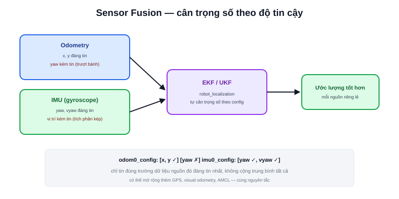

Hai bài trước đã đặt ra vấn đề: [Odometry](/blog/odometry-trong-localization) trôi khi bánh trượt, [IMU](/blog/imu-la-gi) trôi theo tích phân riêng của nó — không nguồn nào một mình đáng tin cậy hoàn toàn. **Sensor Fusion** là kỹ thuật kết hợp nhiều nguồn dữ liệu không hoàn hảo này thành một ước lượng **tốt hơn từng nguồn riêng lẻ**.



## Trực giác: tin nguồn nào nhiều hơn tại mỗi thời điểm

Ý tưởng cốt lõi không phức tạp: mỗi cảm biến đáng tin cậy ở một khía cạnh khác nhau, sensor fusion là cách **tự động cân trọng số** giữa các nguồn đó theo tình huống, thay vì chọn cứng một nguồn duy nhất:

```text
Khi robot đi thẳng, tốc độ ổn định trên sàn phẳng:
    → tin odometry nhiều hơn (encoder chính xác, ít nhiễu trong điều kiện lý tưởng)

Khi robot vừa tăng tốc gấp hoặc đi qua sàn trơn (nghi ngờ trượt bánh):
    → tin gyroscope (IMU) nhiều hơn cho phần góc xoay
```

Vấn đề khó không phải "kết hợp hai con số" (trung bình cộng đơn giản), mà là **biết khi nào nên tin nguồn nào hơn** — đây chính xác là bài toán mà bộ lọc Kalman (Kalman Filter) và biến thể mở rộng của nó, EKF (bài tiếp theo), được thiết kế để giải.

> **Tóm lại:** Sensor fusion không phải "cộng trung bình các cảm biến lại" — nó là quá trình ước lượng liên tục, tự điều chỉnh mức độ tin tưởng vào từng nguồn dựa trên độ không chắc chắn (uncertainty) của chính nguồn đó tại từng thời điểm, và mức độ nhất quán giữa các nguồn với nhau.

## Ví dụ cụ thể: `robot_localization` package trong ROS2

Package phổ biến nhất cho sensor fusion trong hệ sinh thái ROS2 là `robot_localization`, chạy một EKF (hoặc UKF) nhận đầu vào từ nhiều nguồn cùng lúc:

```yaml
ekf_filter_node:
  ros__parameters:
    odom0: /wheel_odometry
    odom0_config: [true,  true,  false,   # x, y, z
                    false, false, true,    # roll, pitch, yaw
                    false, false, false,   # vx, vy, vz
                    false, false, true,    # vroll, vpitch, vyaw
                    false, false, false]   # ax, ay, az
    imu0: /imu/data
    imu0_config: [false, false, false,
                   false, false, true,     # chỉ tin yaw từ IMU
                   false, false, false,
                   false, false, true,     # và vyaw từ gyroscope
                   false, false, false]
```

Mảng cấu hình (`_config`) là nơi khai báo **chính xác trường dữ liệu nào tin từ nguồn nào** — ví dụ cấu hình mẫu trên chỉ tin `x, y` từ odometry bánh xe (không tin `yaw` từ odometry, vì odometry bánh xe thường kém chính xác về góc khi có trượt), nhưng lại tin `yaw` và `vyaw` từ IMU (gyroscope đáng tin hơn cho góc xoay) — đúng theo nguyên tắc "mỗi nguồn đáng tin ở một khía cạnh khác nhau" đã nêu.

## Không chỉ 2 nguồn — sensor fusion mở rộng ra bất kỳ số lượng cảm biến nào

Nguyên lý không giới hạn ở odometry + IMU. Một hệ thống robot đầy đủ có thể fusion thêm GPS (robot ngoài trời), visual odometry (từ camera), hoặc kết quả AMCL (bài tiếp theo) — mỗi nguồn thêm vào cùng nguyên tắc: đóng góp thông tin ở khía cạnh nó đáng tin nhất, được cân trọng số tự động theo độ không chắc chắn ước lượng của chính nguồn đó.
