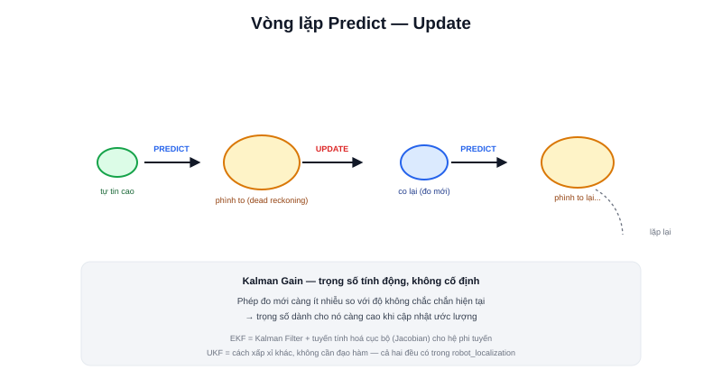

Bài [Sensor Fusion](/blog/sensor-fusion-la-gi) nhắc tới `robot_localization` chạy "một EKF" nhưng chưa giải thích cơ chế bên trong. **EKF (Extended Kalman Filter)** là thuật toán cụ thể trả lời câu hỏi "cân trọng số các nguồn dữ liệu như thế nào" — bằng cách theo dõi không chỉ ước lượng vị trí, mà cả **độ không chắc chắn** của chính ước lượng đó.



## Ý tưởng cốt lõi: theo dõi cả giá trị lẫn độ tin cậy

Khác với chỉ lưu một con số vị trí `(x, y, θ)`, Kalman Filter lưu thêm một ma trận **covariance** — biểu diễn robot "tự tin" tới mức nào về ước lượng hiện tại. Hình dung trực quan: thay vì một điểm chấm duy nhất trên bản đồ, ước lượng là một **hình elip** — elip nhỏ nghĩa là rất tự tin (vị trí gần như chắc chắn đúng), elip lớn nghĩa là không chắc chắn (vị trí có thể lệch nhiều).

## Vòng lặp hai bước: Predict và Update

```text
PREDICT (dự đoán):
    dùng mô hình chuyển động (odometry/IMU) để ước lượng vị trí mới
    → elip không chắc chắn PHÌNH TO thêm (dead reckoning luôn thêm sai số)

UPDATE (cập nhật):
    có phép đo mới (ví dụ so khớp LiDAR với bản đồ)
    → kết hợp phép đo mới với dự đoán, elip không chắc chắn CO LẠI
```

Hai bước lặp lại liên tục: mỗi khi có dữ liệu chuyển động mới (predict), độ không chắc chắn tăng lên (đúng như odometry/IMU trôi dần đã học ở hai bài trước); mỗi khi có phép đo tuyệt đối mới (update), độ không chắc chắn giảm xuống — chính vòng lặp phình-co này là cách Kalman Filter "tự động cân trọng số" mà bài Sensor Fusion đã nhắc tới, không cần lập trình tay quy tắc "khi nào tin nguồn nào".

> **Tóm lại:** Trọng số dành cho phép đo mới (gọi là **Kalman Gain**) không cố định — nó tính toán động dựa trên tỉ lệ giữa độ không chắc chắn của dự đoán và độ không chắc chắn của chính phép đo mới. Phép đo càng đáng tin (nhiễu thấp) so với độ không chắc chắn hiện tại, trọng số dành cho nó càng cao.

## Vì sao gọi là "Extended" — khác Kalman Filter gốc ở đâu

Kalman Filter gốc chỉ đúng toán học hoàn hảo với hệ thống **tuyến tính** (quan hệ giữa các đại lượng chỉ gồm cộng/trừ/nhân hệ số cố định — như phương trình robot vi sai tuyến tính đã thấy ở bài Inverse Kinematics). Nhưng chuyển động thực tế của robot có `sin(θ)`, `cos(θ)` — **phi tuyến**. EKF giải quyết bằng cách **tuyến tính hoá cục bộ** quanh điểm ước lượng hiện tại ở mỗi bước, dùng đạo hàm riêng (ma trận Jacobian) để xấp xỉ hệ phi tuyến bằng một hệ tuyến tính "đủ gần đúng" trong lân cận nhỏ đó.

```text
Kalman Filter gốc:  chỉ đúng với hệ tuyến tính hoàn toàn
EKF:                 xấp xỉ tuyến tính cục bộ (Jacobian) mỗi bước — dùng được cho hệ phi tuyến
UKF (Unscented KF):  một cách xấp xỉ khác, không cần tính đạo hàm, thường chính xác hơn EKF
                     với hệ phi tuyến mạnh — package robot_localization hỗ trợ cả hai
```

## EKF không chỉ dùng để fusion odometry/IMU

Chính thuật toán này — vòng lặp predict/update, theo dõi covariance — cũng là nền tảng toán học bên dưới **AMCL** (bài cuối chuyên mục, dù AMCL dùng particle filter thay vì Kalman Filter thuần) và nhiều bài toán ước lượng trạng thái khác trong robot học. Nắm vững nguyên lý predict-update ở đây là nền tảng để hiểu AMCL dễ dàng hơn nhiều.
