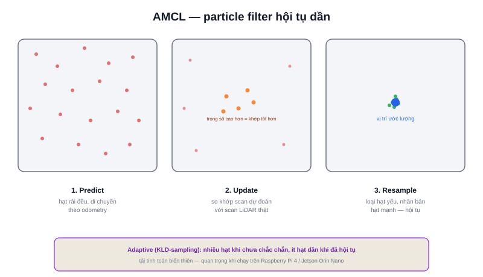

Bài [EKF](/blog/ekf-extended-kalman-filter) theo dõi độ không chắc chắn bằng một elip Gaussian — giả định vị trí thật luôn nằm quanh một đỉnh duy nhất. **AMCL (Adaptive Monte Carlo Localization)** — thuật toán định vị chuẩn của Nav2 — giải cùng bài toán localization nhưng bằng một cách tiếp cận khác hẳn: **particle filter**, không giả định trước hình dạng phân phối vị trí.



## Particle filter: hàng nghìn giả thuyết cạnh tranh nhau

Thay vì một elip duy nhất, AMCL duy trì một tập hợp lớn các **particle (hạt)** — mỗi hạt là một giả thuyết độc lập về vị trí `(x, y, θ)` của robot. Vòng lặp gồm 3 bước, lặp lại liên tục:

```text
1. PREDICT — di chuyển từng hạt theo dữ liệu odometry vừa nhận
              (giống bước Predict của EKF, nhưng áp dụng cho từng hạt riêng)

2. UPDATE — so khớp scan LiDAR dự đoán tại vị trí mỗi hạt với scan LiDAR thực đo được
             → hạt nào dự đoán càng khớp thực tế thì trọng số càng cao

3. RESAMPLE — loại dần các hạt trọng số thấp, nhân bản các hạt trọng số cao
               quanh vùng có khả năng đúng nhất
```

Ba bước này lặp lại mỗi khi robot di chuyển — quần thể hạt dần dần "co cụm" quanh vị trí thật, giống hệt cách một đám đông phỏng đoán dần chính xác hơn khi có thêm bằng chứng.

> **Tóm lại:** EKF trả lời "vị trí trung bình là gì, độ lệch bao nhiêu" bằng công thức đóng (closed-form). AMCL trả lời cùng câu hỏi bằng cách **thử hàng nghìn khả năng cùng lúc** rồi chọn lọc dần — đắt hơn về tính toán, nhưng không bị ràng buộc bởi giả định phân phối Gaussian, xử lý tốt cả trường hợp vị trí ban đầu hoàn toàn không rõ (multi-modal — nhiều "cụm" giả thuyết cùng tồn tại, ví dụ robot có thể đang ở phòng A hoặc phòng B đối xứng nhau).

## Chữ "Adaptive" đến từ đâu

AMCL không giữ cố định số lượng hạt trong suốt quá trình — dùng kỹ thuật **KLD-sampling**: nhiều hạt khi độ bất định còn cao (mới khởi động, chưa rõ vị trí — cần thử nhiều giả thuyết), giảm dần số hạt khi đã hội tụ (vị trí gần như chắc chắn — không cần lãng phí tính toán duy trì hàng nghìn hạt gần giống nhau). Đây là lý do AMCL tiêu tốn tài nguyên tính toán biến thiên theo thời gian, không cố định — điều quan trọng cần biết khi chạy trên phần cứng giới hạn như Raspberry Pi 4 hay Jetson Orin Nano.

## AMCL cần gì để hoạt động

```text
Đầu vào bắt buộc:
  - Bản đồ tĩnh đã có sẵn (từ SLAM — package map_server)
  - Dữ liệu odometry liên tục (bước Predict)
  - Dữ liệu LiDAR liên tục (bước Update)

Đầu ra:
  - Transform map → odom (đã nhắc ở bài Hệ toạ độ và Transform)
    — chính là phần "neo" tuyệt đối bù cho sai số trôi của odometry
```

Khác với SLAM (vừa xây bản đồ vừa định vị), AMCL giả định bản đồ **đã cố định** — chỉ tập trung giải bài toán định vị. Đây là lý do quy trình chuẩn của một robot AMR luôn là: chạy SLAM một lần để xây bản đồ, lưu lại, sau đó chuyển sang chạy AMCL cho các phiên vận hành tiếp theo — nhanh hơn và ổn định hơn nhiều so với chạy SLAM liên tục trong suốt vòng đời robot.
