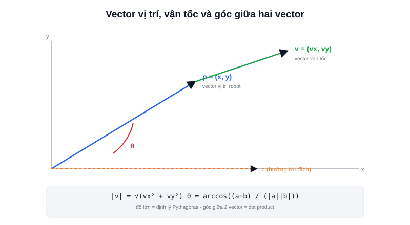

Trước khi đọc được bất kỳ công thức động học robot nào (đã xuất hiện ở bài [Differential Drive và Odometry](/blog/dong-hoc-robot-di-chuyen-differential-drive-odometry)), cần thống nhất một ngôn ngữ toán học chung: **vector**. Vị trí robot trên mặt phẳng, vận tốc di chuyển, hướng của LiDAR quét — tất cả đều là vector.



## Vector là gì, khác gì với một con số

Một con số (scalar) chỉ mang độ lớn — ví dụ "robot đang di chuyển với tốc độ 0.5". Một **vector** mang cả độ lớn lẫn **hướng** — "robot đang di chuyển với vận tốc 0.5 m/s theo hướng 30° so với trục x". Trong robot 2D (mặt phẳng), vector được viết đơn giản dưới dạng cặp toạ độ:

```text
p = (x, y)          # vector vị trí — robot đang ở đâu
v = (vx, vy)         # vector vận tốc — đang di chuyển nhanh/chậm, theo hướng nào
```

Độ lớn (magnitude) của vector — ví dụ tốc độ thực tế bất kể hướng — tính bằng định lý Pythagoras:

```text
|v| = √(vx² + vy²)
```

## Cộng vector — tổng hợp nhiều nguồn chuyển động

Cộng hai vector là cộng từng thành phần tương ứng — ý nghĩa vật lý là **tổng hợp** hai chuyển động xảy ra đồng thời. Ví dụ robot di chuyển trên băng chuyền: vận tốc thực tế so với mặt đất là tổng vector vận tốc của robot cộng vector vận tốc băng chuyền:

```text
v_thuc_te = v_robot + v_bang_chuyen
          = (vx1 + vx2, vy1 + vy2)
```

## Dot product — đo độ "cùng hướng"

Tích vô hướng (dot product) giữa hai vector cho biết chúng cùng hướng đến mức nào — dùng nhiều nhất khi cần tính **góc giữa hai vector** (ví dụ góc lệch giữa hướng robot đang nhìn và hướng cần tới đích):

```text
a · b = ax·bx + ay·by = |a| |b| cos(θ)
```

Từ đây suy ra góc θ giữa hai vector:

```text
θ = arccos( (a · b) / (|a| |b|) )
```

Đây chính xác là phép tính nằm bên dưới câu hỏi "robot cần xoay bao nhiêu độ để hướng thẳng về waypoint tiếp theo" mà bất kỳ bộ điều khiển bám đường đi (path following) nào cũng phải giải.

> **Tóm lại:** Dot product dương → hai vector cùng hướng nhìn chung (góc < 90°); dot product âm → ngược hướng nhau (góc > 90°); dot product bằng 0 → vuông góc. Chỉ cần nhớ dấu của dot product cũng đã đủ để nhanh chóng biết robot đang đi "đúng hướng đại khái" hay "ngược hướng" so với đích, không cần tính đủ góc chính xác.

## Vì sao cần bài này trước khi học Matrix, Rotation, Transform

Vector là viên gạch nền — **Matrix** (bài tiếp theo) chẳng qua là công cụ để biến đổi hàng loạt vector cùng lúc (xoay, dịch chuyển, co giãn) theo cùng một phép toán; **Rotation** và **Transform** đều là những phép biến đổi vector cụ thể. Không nắm vững vector, các bài sau sẽ chỉ là công thức học vẹt thay vì hiểu bản chất.
