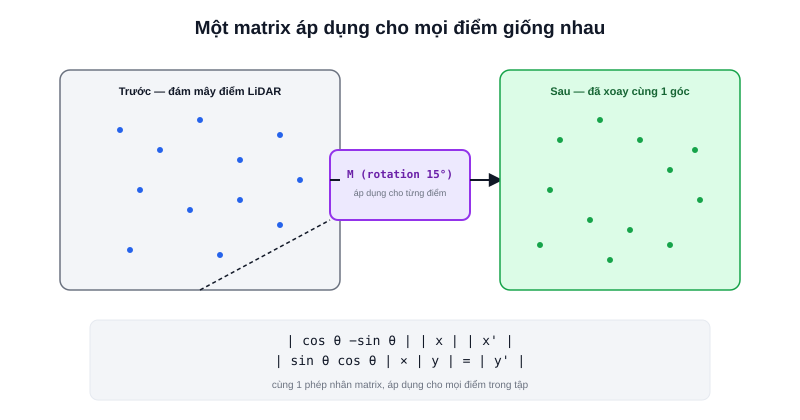

Bài [Vector trong Robotics](/blog/vector-trong-robotics) đã nói vector biểu diễn một điểm hoặc một hướng. Câu hỏi tiếp theo: làm sao xoay/dịch chuyển **hàng nghìn điểm cùng lúc** (toàn bộ đám mây điểm LiDAR, toàn bộ bản đồ occupancy grid) theo cùng một phép biến đổi, mà không cần viết vòng lặp tính riêng từng điểm theo công thức lượng giác? Câu trả lời là **matrix**.



## Matrix là một "máy biến đổi" áp dụng cho mọi vector giống nhau

Một matrix 2×2 nhân với một vector 2D cho ra một vector 2D khác — quy tắc nhân cố định:

```text
| a  b |   | x |   | ax + by |
| c  d | × | y | = | cx + dy |
```

Điều quan trọng: **cùng một matrix M**, nhân với vector nào cũng áp dụng đúng một phép biến đổi đó. Nghĩa là nếu cần xoay 5.000 điểm LiDAR đi 15°, chỉ cần tính một matrix xoay 15° duy nhất, rồi nhân lần lượt với cả 5.000 vector — không cần suy luận lại công thức lượng giác cho từng điểm.

## Ba phép biến đổi matrix hay gặp nhất trong robot 2D

```text
Ma trận đơn vị (identity) — không đổi gì:
| 1  0 |
| 0  1 |

Ma trận xoay (rotation) góc θ:
| cos θ  −sin θ |
| sin θ   cos θ |

Ma trận co giãn (scale) theo hệ số k:
| k  0 |
| 0  k |
```

Ma trận xoay là ma trận dùng nhiều nhất trong robot di động — chính là công thức đứng sau bài [Rotation](/blog/rotation-va-euler-angles) (bài sau) khi cần xoay một vector theo góc heading hiện tại của robot.

> **Tóm lại:** Phép biến đổi bằng matrix **tuyến tính** — nghĩa là không thể dùng nó để dịch chuyển (translate) một điểm, chỉ xoay/co giãn quanh gốc toạ độ (0,0). Đây chính là lý do vì sao robot học cần thêm khái niệm **homogeneous transform** (bài [Transform](/blog/transform-va-phep-bien-doi-toa-do)) — mở rộng matrix để xử lý được cả phép dịch chuyển, không chỉ xoay/co giãn.

## Nhân hai matrix — ghép nhiều phép biến đổi thành một

Khi cần áp dụng liên tiếp nhiều phép biến đổi (ví dụ xoay rồi co giãn), thay vì tính từng bước cho mỗi điểm, có thể **nhân trước hai matrix lại với nhau** thành một matrix tổng hợp duy nhất, rồi mới nhân với toàn bộ tập điểm:

```text
M_tong_hop = M_scale × M_rotate
p_moi = M_tong_hop × p    (thay vì p_moi = M_scale × (M_rotate × p) tính 2 lần)
```

Tính chất này là lý do các thư viện robot (`tf2`, thư viện đồ hoạ 3D) luôn ưu tiên gộp nhiều phép biến đổi thành một matrix trước, rồi mới áp dụng lên toàn bộ dữ liệu — tiết kiệm rất nhiều phép tính khi số điểm cần biến đổi lớn (hàng nghìn điểm LiDAR mỗi lần quét).
