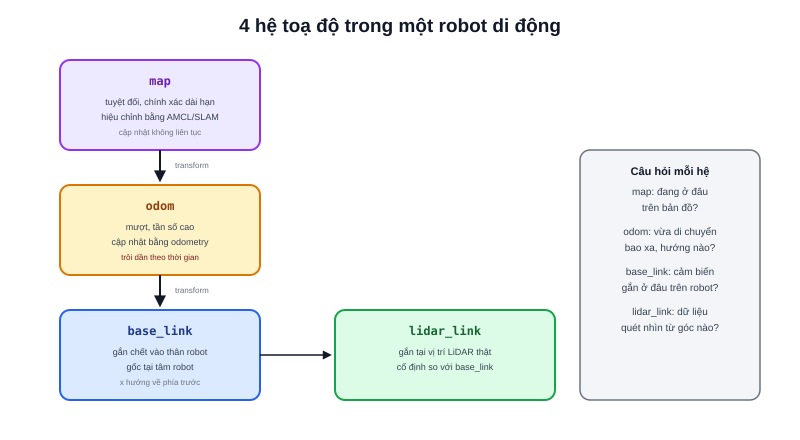

Một điểm LiDAR phát hiện được ở toạ độ `(2, 0.5)` — nhưng 2 mét theo hướng nào, tính từ đâu? Câu hỏi này chỉ có nghĩa khi gắn với một **hệ toạ độ (coordinate frame)** cụ thể. Robot thực tế không dùng một hệ toạ độ duy nhất — luôn cần ít nhất 3-4 hệ khác nhau, mỗi hệ trả lời đúng một câu hỏi.



## Bốn hệ toạ độ phổ biến trong robot di động

- **`base_link`** — gắn chết vào thân robot, gốc toạ độ thường đặt tại tâm robot, trục x hướng về phía trước. Toạ độ một cảm biến gắn cứng trên robot (vị trí LiDAR so với tâm robot) luôn cố định trong hệ này — không đổi dù robot di chuyển đi đâu
- **`odom`** — hệ toạ độ "cục bộ", gốc đặt tại vị trí robot lúc khởi động, cập nhật liên tục theo odometry (bài [Differential Drive và Odometry](/blog/dong-hoc-robot-di-chuyen-differential-drive-odometry)). Mượt, cập nhật tần số cao, nhưng **trôi dần theo thời gian** vì sai số tích luỹ
- **`map`** — hệ toạ độ "tuyệt đối" so với bản đồ đã biết, được hiệu chỉnh định kỳ bằng SLAM/AMCL để triệt tiêu sai số trôi của `odom`. Không mượt bằng `odom` (chỉ cập nhật khi có lần đối chiếu bản đồ mới) nhưng chính xác dài hạn hơn
- **`sensor_frame`** (ví dụ `lidar_link`, `camera_link`) — gắn tại đúng vị trí vật lý của từng cảm biến, dùng để biết dữ liệu cảm biến "nhìn thấy" từ góc nào so với robot

## Vì sao không dùng luôn một hệ toạ độ duy nhất?

Mỗi hệ phục vụ một nhu cầu khác nhau, đánh đổi giữa "mượt" và "chính xác dài hạn":

```text
base_link  →  cố định so với robot, dùng để biết cảm biến gắn ở đâu
odom       →  mượt, tần số cao, dùng cho điều khiển tức thời — nhưng trôi dần
map        →  chính xác dài hạn, dùng cho lập kế hoạch đường đi toàn cục — cập nhật chậm hơn
```

Nếu chỉ dùng `map` cho mọi thứ, robot sẽ "giật" mỗi khi AMCL hiệu chỉnh lại vị trí (cập nhật không liên tục, đôi khi nhảy vọt). Nếu chỉ dùng `odom`, vị trí sẽ trôi dần không giới hạn theo thời gian, không thể tin cậy cho các quyết định dài hạn. Tách hai hệ riêng cho phép mỗi bộ điều khiển dùng đúng loại dữ liệu phù hợp với tần số/độ chính xác nó cần.

> **Tóm lại:** Câu hỏi "toạ độ này là bao nhiêu?" luôn phải đi kèm câu hỏi thứ hai "so với hệ toạ độ nào?" — bỏ qua vế thứ hai là nguồn gốc của phần lớn lỗi robot "chạy sai vị trí" dù công thức tính toán hoàn toàn đúng.

## Chuyển đổi giữa các hệ toạ độ

Biết toạ độ một điểm trong hệ này, muốn biết toạ độ tương ứng trong hệ khác — cần một phép **transform** (bài tiếp theo, sau khi qua Rotation và Quaternion) nối hai hệ lại. Chuỗi các phép transform nối tiếp nhau tạo thành cái mà ROS2 gọi là **TF tree** — mỗi hệ toạ độ là một node, mỗi cạnh nối hai node là một transform, và việc "toạ độ điểm này trong hệ map là bao nhiêu" chẳng qua là nhân liên tiếp các transform dọc theo đường đi từ hệ gốc tới hệ đích trong cây đó.
