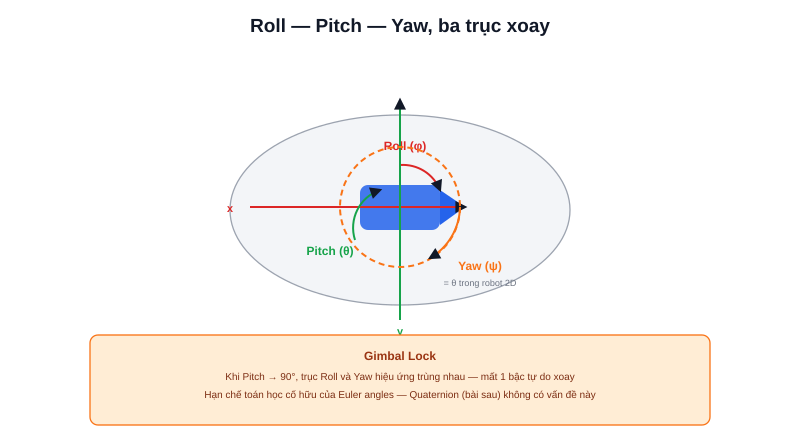

Robot di động 2D (mọi robot trong showcase dự án của trang này) chỉ cần một con số duy nhất để biết đang "nhìn" hướng nào: góc heading θ. Nhưng ngay khi có IMU đo cả 3 trục, hoặc robot có tay máy/gắn camera xoay được nhiều bậc tự do, một góc thôi không đủ — cần biểu diễn hướng trong không gian 3D đầy đủ. Cách trực quan nhất là **Euler angles**.



## Roll, Pitch, Yaw — ba góc xoay quanh ba trục

```text
Roll  (φ) — xoay quanh trục x (trước-sau) — robot "nghiêng" trái/phải
Pitch (θ) — xoay quanh trục y (trái-phải) — robot "cúi/ngẩng" đầu
Yaw   (ψ) — xoay quanh trục z (lên-xuống) — robot "quay" trái/phải — chính là θ trong robot 2D
```

Với robot di động chạy trên mặt phẳng, Roll và Pitch gần như luôn xấp xỉ 0 (trừ khi đi qua dốc/gồ ghề) — chỉ Yaw thay đổi liên tục, đây là lý do robot 2D chỉ cần theo dõi một góc duy nhất. IMU (bài [IMU là gì?](/blog/imu-la-gi)) là cảm biến đo trực tiếp cả ba góc này.

## Vấn đề với Euler angles: Gimbal Lock

Euler angles dễ hình dung nhưng có một nhược điểm nghiêm trọng: khi một trong ba góc (thường là Pitch) tiến gần 90°, **hai trục xoay còn lại trở nên trùng nhau về mặt hiệu ứng** — mất đi một bậc tự do xoay. Hiện tượng này gọi là **gimbal lock**.

```text
Pitch = 90°  →  trục xoay Roll và Yaw hiệu ứng trùng nhau
             →  không còn cách nào xoay riêng biệt theo 2 trục đó nữa
```

Về mặt toán học, một số tổ hợp góc gây ra tính toán không ổn định (chia cho số gần 0) khi chuyển đổi qua lại giữa Euler angles và các dạng biểu diễn khác — robot bay (drone) với chuyển động lật ngửa/cúi gập mạnh là trường hợp dễ gặp gimbal lock nhất trong thực tế.

> **Tóm lại:** Gimbal lock không phải lỗi cảm biến hay lỗi code — nó là hạn chế **cố hữu về mặt toán học** của cách biểu diễn Euler angles. Cách duy nhất né được hoàn toàn là đổi sang một cách biểu diễn khác không có điểm kỳ dị (singularity) này — chính là **Quaternion** (bài tiếp theo).

## Ma trận xoay 3D từ ba góc Euler

Mỗi góc Euler tương ứng một ma trận xoay quanh đúng một trục (mở rộng công thức ma trận xoay 2D đã học ở bài [Matrix](/blog/matrix-va-phep-bien-doi)); nhân ba ma trận này theo đúng thứ tự cho ra ma trận xoay tổng hợp:

```text
R = R_z(yaw) × R_y(pitch) × R_x(roll)
```

Thứ tự nhân **quan trọng** — vì phép nhân matrix không giao hoán (`A × B ≠ B × A`), xoay theo thứ tự Yaw→Pitch→Roll cho kết quả khác với Roll→Pitch→Yaw dù cùng ba góc số. Đây là một nguồn lỗi phổ biến khi làm việc với nhiều thư viện/phần mềm dùng quy ước thứ tự khác nhau — luôn cần kiểm tra tài liệu quy ước trước khi ghép dữ liệu góc từ hai nguồn khác nhau.
