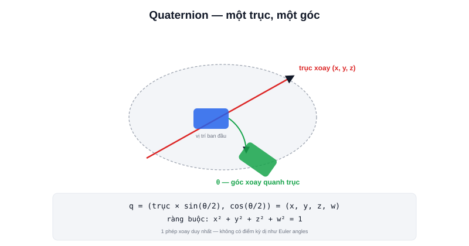

Mở bất kỳ message `nav_msgs/msg/Odometry` hay `geometry_msgs/msg/PoseStamped` nào trong ROS2, phần hướng (orientation) không lưu một góc θ quen thuộc, mà là 4 con số `(x, y, z, w)` — một **quaternion**. Đây không phải lựa chọn ngẫu nhiên: quaternion là cách biểu diễn hướng chuẩn trong toàn bộ hệ sinh thái ROS2/ROS, chính vì nó giải quyết được vấn đề gimbal lock đã nêu ở bài [Rotation và Euler Angles](/blog/rotation-va-euler-angles).



## Trực giác: một phép xoay = một trục + một góc

Thay vì nghĩ "xoay 30° quanh x, rồi 45° quanh y, rồi 10° quanh z" (ba bước tuần tự dễ gây gimbal lock), quaternion biểu diễn **bất kỳ hướng xoay 3D nào cũng chỉ bằng một phép xoay duy nhất** — quay một góc θ quanh **một trục duy nhất** (không nhất thiết trùng trục x/y/z, có thể là trục bất kỳ trong không gian):

```text
q = (x, y, z, w)
  = (trục_xoay × sin(θ/2), cos(θ/2))
```

`(x, y, z)` mã hoá hướng của trục xoay, `w` mã hoá góc xoay quanh trục đó. Với `θ = 0` (không xoay gì), quaternion là `(0, 0, 0, 1)` — giá trị "identity" hay gặp khi khởi tạo orientation mặc định.

> **Tóm lại:** Vì một phép xoay chỉ cần đúng một trục + một góc (không phải ba bước tuần tự quanh ba trục cố định như Euler), quaternion không có điểm kỳ dị nào trong toàn bộ không gian xoay — đây là lý do toán học chính xác vì sao nó "không bị gimbal lock".

## Vì sao 4 số cho một phép xoay chỉ có 3 bậc tự do?

Một quaternion có 4 thành phần nhưng phép xoay 3D chỉ có 3 bậc tự do (Roll, Pitch, Yaw) — sự chênh lệch này được giải quyết bằng ràng buộc: quaternion hợp lệ luôn có độ dài (norm) bằng 1:

```text
x² + y² + z² + w² = 1
```

Ràng buộc "đơn vị" (unit quaternion) này giảm 4 số xuống còn đúng 3 bậc tự do độc lập — khớp với số bậc tự do thật của một phép xoay 3D. Một hệ quả thực tế: nếu tự tính toán và cộng dồn quaternion qua nhiều bước (thường gặp khi tích hợp vận tốc góc từ IMU theo thời gian), sai số làm tròn có thể khiến `x²+y²+z²+w²` lệch dần khỏi 1 — cần **chuẩn hoá (normalize)** định kỳ để quaternion luôn hợp lệ.

## Nội suy giữa hai hướng — vì sao quaternion mượt hơn Euler

Một lý do thực tế khác quaternion được ưa chuộng: nội suy mượt giữa hai hướng xoay (ví dụ animation robot xoay từ từ từ hướng A sang hướng B) dùng kỹ thuật **SLERP** (Spherical Linear Interpolation) trên quaternion cho ra chuyển động xoay với tốc độ góc đều — nội suy trực tiếp trên góc Euler dễ tạo chuyển động không đều hoặc đi qua đường xoay "vòng xa hơn" không cần thiết.

## Chuyển đổi qua lại với Euler khi cần đọc hiểu bằng mắt

```python
from tf_transformations import euler_from_quaternion, quaternion_from_euler

roll, pitch, yaw = euler_from_quaternion([q.x, q.y, q.z, q.w])
q_x, q_y, q_z, q_w = quaternion_from_euler(roll, pitch, yaw)
```

Trong thực tế, code tính toán/lưu trữ luôn nên dùng quaternion (khớp chuẩn ROS2, không bị gimbal lock), nhưng khi debug hoặc hiển thị cho người đọc, chuyển tạm sang Euler (đặc biệt là Yaw — góc heading duy nhất người vận hành quan tâm ở robot 2D) dễ hiểu hơn nhiều so với đọc trực tiếp 4 số `(x, y, z, w)`.
