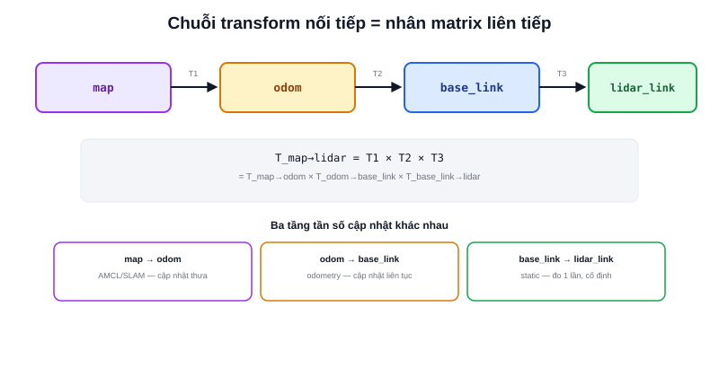

Bài [Matrix trong Robotics](/blog/matrix-va-phep-bien-doi) đã để lại một câu hỏi mở: ma trận xoay/co giãn thuần chỉ biến đổi được vector quanh gốc toạ độ (0,0) — không thể dùng nó để **dịch chuyển** một điểm sang vị trí khác. Nhưng một cảm biến gắn trên robot vừa lệch vị trí (translation) vừa lệch hướng (rotation) so với tâm robot. **Homogeneous transform** là cách gộp cả hai phép biến đổi vào đúng một ma trận.



## Thêm một chiều "giả" để dịch chuyển được bằng phép nhân

Mẹo toán học: thêm một thành phần thứ 3 (luôn bằng 1) vào vector 2D, biến `(x, y)` thành `(x, y, 1)` — gọi là toạ độ đồng nhất (homogeneous coordinates). Với vector mở rộng này, một ma trận 3×3 có thể biểu diễn **cả xoay lẫn dịch chuyển** trong đúng một phép nhân:

```text
| cos θ  −sin θ  tx |   | x |   | x' |
| sin θ   cos θ  ty | × | y | = | y' |
|   0       0     1 |   | 1 |   | 1  |
```

Hai cột `tx`, `ty` chính là phần dịch chuyển (translation); khối 2×2 góc trên-trái là phần xoay (rotation) đã học ở bài Matrix. Đây chính xác là loại ma trận `tf2` dùng nội bộ để lưu và tính toán mọi phép biến đổi giữa các hệ toạ độ đã nói ở bài [Hệ toạ độ trong Robot](/blog/he-toa-do-trong-robot).

> **Tóm lại:** "Transform" giữa hai hệ toạ độ = một cặp (rotation, translation) gộp chung vào một ma trận homogeneous — trả lời đúng câu hỏi "điểm này lệch bao xa (translation) và lệch hướng bao nhiêu (rotation) giữa hệ A và hệ B".

## Nối chuỗi nhiều transform — đúng cơ chế TF tree

Lợi ích lớn nhất của homogeneous transform: nối nhiều phép biến đổi liên tiếp chỉ là **nhân các ma trận lại với nhau**, đúng như đã học ở bài Matrix:

```text
T_map→base_link = T_map→odom × T_odom→base_link
T_map→lidar     = T_map→base_link × T_base_link→lidar
```

Đây chính là cách `tf2` trả lời câu hỏi "điểm này trong hệ `lidar_link` tương ứng toạ độ bao nhiêu trong hệ `map`" — không cần biết trực tiếp quan hệ `map`↔`lidar_link`, chỉ cần nhân liên tiếp các transform dọc theo đường đi giữa hai node trong TF tree (`map → odom → base_link → lidar_link`), mỗi cạnh trên đường đi đó là một transform đã biết.

## Transform tĩnh và transform động

```text
static_transform_publisher   →  base_link → lidar_link (cố định, đo 1 lần lúc lắp ráp)
odom_publisher (chạy liên tục) →  odom → base_link (đổi liên tục theo odometry)
amcl (chạy định kỳ)            →  map → odom (đổi mỗi khi AMCL hiệu chỉnh)
```

Không phải transform nào cũng đổi liên tục — vị trí cảm biến so với thân robot (`base_link → lidar_link`) cố định vĩnh viễn sau khi lắp ráp xong, khai một lần bằng `static_transform_publisher`. Ngược lại, `odom → base_link` đổi liên tục theo từng chu kỳ odometry, và `map → odom` chỉ đổi khi AMCL/SLAM hiệu chỉnh lại — đúng ba tầng tần số cập nhật khác nhau đã nêu ở bài Hệ toạ độ, giờ đã có công cụ toán học (ma trận homogeneous) để tính toán chính xác.
