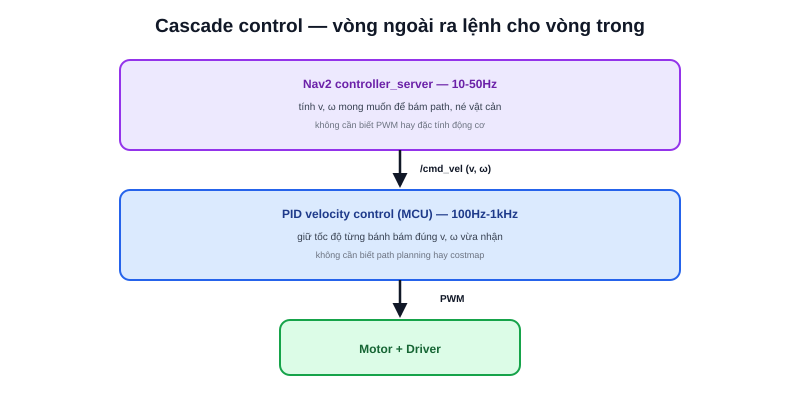

Bài [PID là gì?](/blog/pid-la-gi) (chuyên mục Lập trình nhúng) đã giải thích chi tiết ba thành phần P/I/D, code C, và quy trình tuning tay cho một vòng lặp PID cụ thể — giữ tốc độ động cơ. Bài này không lặp lại nội dung đó, mà đặt PID đúng vị trí của nó trong bức tranh lớn hơn: một robot hoàn chỉnh hiếm khi chỉ có **một** vòng PID — mà là **nhiều vòng lồng nhau**, mỗi vòng phụ trách một tầng khác nhau.



## PID là ví dụ cụ thể nhất của Closed-loop Control

Bài [Sense-Think-Act](/blog/vong-lap-dieu-khien-robot-sense-think-act) mô tả vòng lặp tổng quát Cảm biến→Xử lý→Điều khiển; bài [Điều khiển vòng kín](/blog/dieu-khien-vong-kin-closed-loop) mô tả nguyên lý closed-loop tổng quát (đo → so sánh → sửa sai). PID chính là **thuật toán cụ thể nhất, phổ biến nhất** để hiện thực hoá bước "so sánh → sửa sai" đó — không phải khái niệm riêng biệt, mà là một lựa chọn thuật toán trong khuôn khổ closed-loop đã học.

## Cascade control: PID cấp cao ra lệnh cho PID cấp thấp

Ví dụ thực tế trong một robot AMR: bộ điều khiển Nav2 (tầng cao) không trực tiếp set PWM — nó tính ra vận tốc mong muốn `(v, ω)`, gửi xuống tầng thấp hơn qua `/cmd_vel`. Tầng thấp đó lại chạy **một vòng PID riêng** (bài [Điều khiển tốc độ](/blog/dieu-khien-toc-do-velocity-control)) để giữ đúng tốc độ bánh xe theo lệnh vừa nhận. Đây là mô hình **cascade control** (điều khiển tầng bậc) — output của vòng lặp cấp cao là setpoint đầu vào cho vòng lặp cấp thấp hơn:

```text
Nav2 controller_server (10-50Hz)
    │  tính v, ω mong muốn để bám path, né vật cản
    ▼
/cmd_vel
    │
    ▼
PID velocity control trên MCU (100Hz-1kHz)
    │  giữ tốc độ từng bánh bám đúng v, ω vừa nhận
    ▼
PWM → Motor
```

> **Tóm lại:** Vòng ngoài (Nav2) không cần biết gì về PWM hay đặc tính động cơ — nó chỉ cần ra lệnh vận tốc mong muốn. Vòng trong (PID trên MCU) không cần biết gì về path planning hay costmap — nó chỉ cần bám đúng setpoint vừa nhận. Tách tầng như vậy giúp mỗi vòng PID đơn giản, dễ tune độc lập, dù toàn hệ thống rất phức tạp.

## Vì sao tách tầng thay vì một PID khổng lồ duy nhất

Về lý thuyết có thể tưởng tượng một bộ điều khiển "khổng lồ" nhận thẳng dữ liệu LiDAR, tính thẳng ra PWM từng bánh — nhưng cách này gần như không ai làm trong thực tế, vì hai lý do:

- **Tần số khác nhau quá xa** — vòng bám path chỉ cần cập nhật 10-50Hz, vòng giữ tốc độ bánh cần 100Hz-1kHz để đủ mượt và ổn định; gộp chung buộc phải chạy mọi thứ ở tần số cao nhất, lãng phí tài nguyên tính toán ở tầng không cần thiết
- **Debug dễ hơn khi tách rời** — nếu robot "đi sai path", biết ngay vấn đề nằm ở Nav2 (tầng ngoài); nếu robot "tốc độ không ổn định dù path đúng", biết ngay vấn đề nằm ở PID tầng trong — tách tầng giúp khoanh vùng lỗi nhanh, đúng tinh thần đã nói ở bài Sense-Think-Act

Mô hình cascade này không riêng gì robot di động — cùng nguyên tắc xuất hiện ở tay máy công nghiệp (vòng vị trí bao ngoài vòng vận tốc, bao ngoài vòng dòng điện), hay hệ thống điều hoà công nghiệp (vòng nhiệt độ phòng bao ngoài vòng điều khiển van). Hiểu PID như một khối xây dựng (building block) có thể lồng nhiều tầng, thay vì chỉ một vòng lặp đơn lẻ, là bước quan trọng để đọc hiểu kiến trúc điều khiển của bất kỳ hệ robot thực tế nào.
