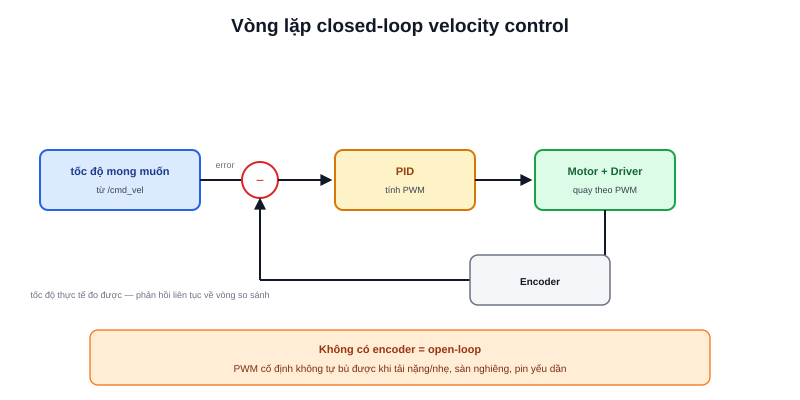

Bài [ros2 topic](/blog/ros2-topic) đã dùng lệnh `ros2 topic pub /cmd_vel geometry_msgs/msg/Twist` để gửi lệnh vận tốc. Nhưng gửi lệnh chỉ là **mong muốn** — driver động cơ phải tự tìm cách đạt đúng tốc độ đó trong thực tế, bất kể tải nặng/nhẹ, sàn nhám/trơn, hay pin đang yếu dần. Đây chính xác là bài toán **velocity control**.



## Open-loop: đặt PWM và hy vọng đúng tốc độ

Cách đơn giản nhất — không dùng phản hồi gì cả — là ánh xạ trực tiếp tốc độ mong muốn sang một giá trị PWM cố định, dựa trên thông số động cơ lý thuyết:

```text
PWM = tốc_độ_mong_muốn / tốc_độ_tối_đa × 255
```

Vấn đề: PWM 50% trên sàn phẳng cho tốc độ X, nhưng cùng PWM 50% đó trên sàn nghiêng hoặc khi robot chở thêm tải sẽ cho tốc độ **thấp hơn X** — vì PWM chỉ kiểm soát điện áp trung bình cấp cho động cơ, không kiểm soát trực tiếp tốc độ quay thực tế. Đây gọi là điều khiển **open-loop** (vòng hở) — không có cách nào tự phát hiện và sửa sai lệch.

## Closed-loop: đọc encoder, dùng PID chỉnh lại

Velocity control đúng nghĩa cần một vòng phản hồi: đọc tốc độ thực tế từ encoder, so sánh với tốc độ mong muốn, dùng [PID](/blog/pid-la-gi) liên tục chỉnh PWM để triệt tiêu sai lệch:

```text
loop (tần số cố định, ví dụ 100Hz):
    toc_do_thuc_te = doc_encoder()
    error = toc_do_mong_muon − toc_do_thuc_te
    pwm = pid.compute(error, dt)
    set_pwm(pwm)
```

Khi robot leo lên dốc nhẹ hoặc chở thêm tải, tốc độ thực tế đo được sẽ tụt xuống dưới mong muốn ngay lập tức — PID tự động tăng PWM để bù lại, giữ tốc độ ổn định mà không cần biết trước tải trọng hay độ dốc là bao nhiêu. Đây chính là mô hình "vòng lặp" đã học ở bài [Sense-Think-Act](/blog/vong-lap-dieu-khien-robot-sense-think-act) áp dụng cụ thể cho bài toán tốc độ.

> **Tóm lại:** Open-loop chỉ đúng khi mọi điều kiện đều lý tưởng và không đổi — trong thực tế gần như không bao giờ đúng. Closed-loop (dùng encoder + PID) là cách duy nhất đảm bảo tốc độ thực tế bám sát tốc độ mong muốn khi điều kiện vận hành thay đổi liên tục, điều luôn xảy ra với robot di động thật.

## Hai tầng velocity control trong một robot ROS2

```text
Tầng cao (ROS2, trên MPU): /cmd_vel (v, ω) → inverse kinematics → v_L, v_R mong muốn
Tầng thấp (MCU): vòng PID velocity control cho từng bánh, chạy 100Hz-1kHz
```

Việc chuyển `/cmd_vel` thành tốc độ mong muốn cho từng bánh (bài [Differential Drive](/blog/dong-hoc-robot-di-chuyen-differential-drive-odometry)) chỉ là bước đầu — bước quan trọng không kém nằm ở MCU, nơi vòng PID velocity control thực sự chạy đủ nhanh (tần số cao, độ trễ thấp) để giữ từng bánh bám đúng tốc độ mong muốn đó theo thời gian thực.
