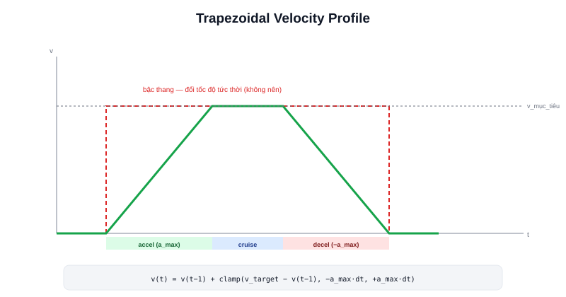

Bài [Điều khiển tốc độ](/blog/dieu-khien-toc-do-velocity-control) đã giả định bộ điều khiển tốc độ luôn có thể đạt ngay tốc độ mong muốn. Trong thực tế, nhảy thẳng từ 0 lên tốc độ tối đa (hoặc ngược lại) trong một chu kỳ điều khiển là điều **không nên làm**, kể cả khi động cơ đủ khoẻ để làm được — đây là lý do khái niệm giới hạn gia tốc (acceleration limit) luôn xuất hiện trong cấu hình Nav2 và mọi bộ điều khiển robot nghiêm túc.



## Vì sao không nên đổi tốc độ tức thời

- **Trượt bánh (wheel slip)** — thay đổi tốc độ đột ngột đòi hỏi lực ma sát tức thời rất lớn giữa bánh và mặt sàn; vượt quá giới hạn ma sát tĩnh, bánh trượt thay vì lăn — dữ liệu odometry (dựa trên số vòng quay bánh, bài [Odometry](/blog/odometry-trong-localization)) trở nên sai lệch ngay lập tức
- **Giật cơ khí** — khung robot, giá đỡ cảm biến, hàng hoá chở trên robot (với AMR công nghiệp) đều chịu lực quán tính lớn khi gia tốc đột ngột — về lâu dài gây mỏi/hỏng kết cấu
- **Dòng điện tức thời quá lớn** — động cơ đổi tốc độ nhanh cần dòng điện tức thời cao, có thể vượt giới hạn driver hoặc gây sụt áp ảnh hưởng các module điện tử khác

## Trapezoidal velocity profile — hình thang thay vì bậc thang

Giải pháp chuẩn: thay vì đổi tốc độ tức thời (dạng bậc thang), giới hạn **tốc độ thay đổi tối đa mỗi chu kỳ** — tạo ra đồ thị vận tốc theo thời gian có dạng hình thang: tăng tốc dần (accel), giữ đều ở tốc độ đích (cruise), giảm tốc dần (decel):

```text
v_lenh(t) = v_hien_tai + clamp(v_muc_tieu − v_hien_tai, −a_max·dt, +a_max·dt)
```

Mỗi chu kỳ điều khiển, tốc độ lệnh gửi xuống chỉ được phép thay đổi tối đa `a_max·dt` so với chu kỳ trước — dù tốc độ mục tiêu đổi đột ngột (ví dụ lệnh dừng khẩn), giá trị thực sự gửi xuống động cơ vẫn giảm dần theo đúng giới hạn gia tốc đã cấu hình.

> **Tóm lại:** "Dừng ngay lập tức" trong phần mềm điều khiển robot bình thường **không có nghĩa** là set PWM = 0 ngay trong một chu kỳ — nó có nghĩa là bắt đầu giảm tốc với gia tốc âm tối đa cho phép, đạt 0 sau một khoảng thời gian ngắn nhưng khác 0. Chỉ trường hợp E-Stop phần cứng (ngắt nguồn động cơ trực tiếp) mới thực sự dừng tức thời — và chính vì vậy E-Stop luôn là mạch cứng riêng biệt, không đi qua phần mềm.

## Cấu hình trong Nav2

```yaml
controller_server:
  ros__parameters:
    FollowPath:
      max_vel_x: 0.5
      acc_lim_x: 1.0        # giới hạn gia tốc tuyến tính (m/s²)
      max_vel_theta: 1.0
      acc_lim_theta: 2.0     # giới hạn gia tốc góc (rad/s²)
```

`acc_lim_x`/`acc_lim_theta` chính là `a_max` trong công thức trên — Nav2's controller (DWB/MPPI, đã nhắc trong nội dung dự án [Atlas A2](/du-an/atlas-a2)) luôn tôn trọng giới hạn này khi tính vận tốc lệnh mỗi chu kỳ, đảm bảo robot không bao giờ nhận lệnh đổi tốc độ vượt quá khả năng vật lý đã cấu hình.
