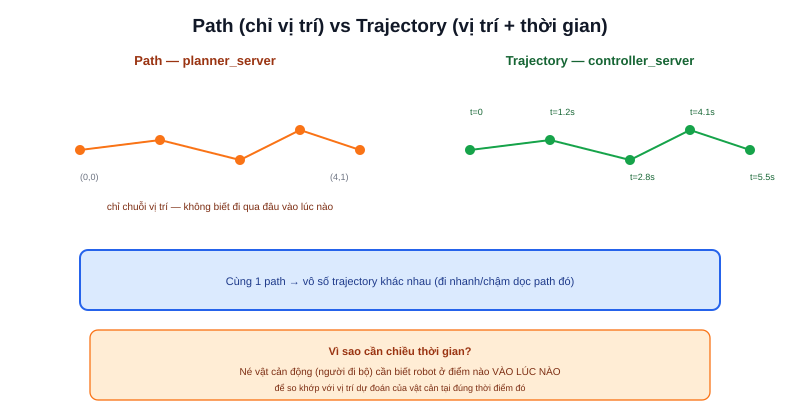

Hai từ "path" và "trajectory" hay bị dùng lẫn lộn, nhưng trong robot học có ý nghĩa khác nhau rõ rệt — và sự khác biệt đó **quan trọng thực sự**, không chỉ là chơi chữ.



## Path — chuỗi điểm, không quan tâm thời gian

**Path** (đường đi) chỉ là một chuỗi vị trí `(x, y)` nối tiếp nhau trong không gian — trả lời câu hỏi "robot cần đi qua những điểm nào để tới đích", không nói gì về **khi nào** robot ở điểm nào. Đây chính là kết quả của `planner_server` trong Nav2 (đã nhắc ở nội dung dự án [Atlas A2](/du-an/atlas-a2)) — publish trên topic `/plan`.

```text
path = [(0,0), (1,0), (2,0.5), (3,1), (4,1)]   # chỉ có vị trí, không có thời gian
```

## Trajectory — path cộng thêm chiều thời gian

**Trajectory** (quỹ đạo) là path **cộng thêm** thông tin robot sẽ ở mỗi điểm vào lúc nào — nói cách khác, trajectory gắn một mốc thời gian (hoặc tương đương: một vận tốc) cho từng điểm trên path:

```text
trajectory = [(0,0,t=0), (1,0,t=1.2s), (2,0.5,t=2.8s), (3,1,t=4.1s), (4,1,t=5.5s)]
```

> **Tóm lại:** Path trả lời "đi qua đâu", Trajectory trả lời "đi qua đâu **và khi nào**". Một path duy nhất có thể sinh ra vô số trajectory khác nhau — đi chậm rãi hay đi nhanh dọc theo đúng cùng một path đó vẫn là cùng một path, nhưng là hai trajectory khác nhau.

## Vì sao chiều thời gian lại quan trọng: né vật cản động

Path tĩnh không đủ để né một vật cản đang di chuyển (người đi bộ cắt ngang) — biết "robot sẽ đi qua điểm này" là chưa đủ, cần biết **khi nào** robot ở đó để so sánh với dự đoán vị trí người đi bộ tại đúng thời điểm đó. Đây là lý do các bộ điều khiển hiện đại như MPPI (đã nhắc ở bài Nav2 trong dự án Atlas A2) làm việc trực tiếp trên trajectory — dự đoán nhiều trajectory khả dĩ trong vài giây tới, chấm điểm mỗi trajectory dựa trên khả năng va chạm với vật cản động tại đúng thời điểm dự kiến, không chỉ dựa trên path tĩnh.

## controller_server: từ Path (tĩnh) ra Trajectory (theo thời gian thực)

```text
planner_server  →  path (chuỗi điểm tĩnh, tính 1 lần khi có goal mới)
controller_server → trajectory (vận tốc theo thời gian thực, tính lại mỗi chu kỳ)
                     bám theo path, tôn trọng giới hạn gia tốc (bài trước),
                     né vật cản động phát sinh
```

`planner_server` tính path một lần (hoặc khi bản đồ/costmap thay đổi lớn); `controller_server` liên tục tính lại trajectory theo thời gian thực để bám path đó, đồng thời phản ứng với những gì cảm biến vừa phát hiện — đây chính là ranh giới rõ ràng nhất giữa hai khái niệm "path" và "trajectory" trong một hệ thống điều hướng robot thực tế.
