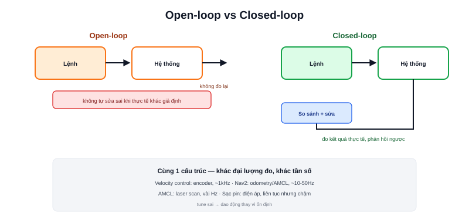

Các bài trước trong chuyên mục này — [PID](/blog/pid-la-gi), [Điều khiển tốc độ](/blog/dieu-khien-toc-do-velocity-control) — đều là ứng dụng cụ thể của **một nguyên lý duy nhất**: điều khiển vòng kín (closed-loop control). Bài này lùi lại một bước, nhìn nguyên lý đó ở dạng tổng quát nhất, để thấy nó lặp lại ở mọi tầng của một hệ thống robot, không chỉ riêng điều khiển động cơ.



## Open-loop: ra lệnh và không kiểm tra lại

**Open-loop** (vòng hở) là điều khiển không có phản hồi — ra lệnh một lần, tin tưởng hệ thống sẽ thực hiện đúng, không bao giờ kiểm tra lại kết quả thực tế:

```text
lệnh → hệ thống → kết quả (không đo lại, không so sánh với mục tiêu)
```

Ví dụ: đặt hẹn giờ lò vi sóng 2 phút mà không có cảm biến nhiệt độ — lò chạy đúng 2 phút bất kể thức ăn đã đủ nóng hay chưa. Đơn giản, rẻ, nhưng **không tự sửa sai** khi điều kiện thực tế khác giả định.

## Closed-loop: đo, so sánh, sửa sai — lặp lại liên tục

**Closed-loop** (vòng kín) thêm một đường phản hồi (feedback loop): đo kết quả thực tế, so sánh với mục tiêu, dùng sai lệch đó để điều chỉnh lệnh tiếp theo:

```text
lệnh → hệ thống → kết quả thực tế
   ↑                    │
   └──── so sánh với mục tiêu, sinh lệnh mới ────┘
```

> **Tóm lại:** Sự khác biệt cốt lõi không nằm ở độ phức tạp thuật toán — một PID đơn giản vẫn là closed-loop, một hệ thống phức tạp không đo lại kết quả vẫn là open-loop. Câu hỏi duy nhất cần trả lời: **hệ thống có tự kiểm tra và sửa sai dựa trên kết quả thực tế hay không?**

## Cùng một nguyên lý, xuất hiện ở nhiều tầng khác nhau

| Tầng | Đo gì (feedback) | So sánh với gì | Sửa sai bằng gì |
|---|---|---|---|
| Điều khiển tốc độ động cơ | Encoder | Tốc độ mong muốn | PID chỉnh PWM |
| Bám đường đi (Nav2 controller) | Vị trí thực tế (odometry/AMCL) | Path đã lập kế hoạch | Điều chỉnh v, ω |
| Định vị (AMCL) | Scan LiDAR thực tế | Scan dự đoán theo bản đồ | Điều chỉnh ước lượng vị trí |
| Sạc pin tự động | Điện áp pin đo được | Ngưỡng pin đầy | Điều chỉnh dòng sạc |

Bốn tầng này vận hành ở tần số hoàn toàn khác nhau (PID động cơ có thể chạy 1kHz, AMCL chạy vài Hz) và đo những đại lượng hoàn toàn khác nhau — nhưng đều tuân theo đúng một cấu trúc: đo → so sánh → sửa sai → lặp lại.

## Cái giá của closed-loop: độ trễ và ổn định

Closed-loop không miễn phí — thêm cảm biến (chi phí phần cứng), thêm độ trễ (thời gian đo + tính toán + phản hồi), và nếu tune sai (như đã nói ở bài PID) có thể gây **dao động** thay vì ổn định — hệ thống liên tục "sửa quá tay" theo cả hai hướng. Đây là lý do thiết kế một hệ điều khiển closed-loop tốt không chỉ là "thêm cảm biến vào cho chắc", mà cần hiểu rõ độ trễ hệ thống và tune tham số phù hợp — đúng như quy trình tuning PID đã trình bày ở bài trước.
