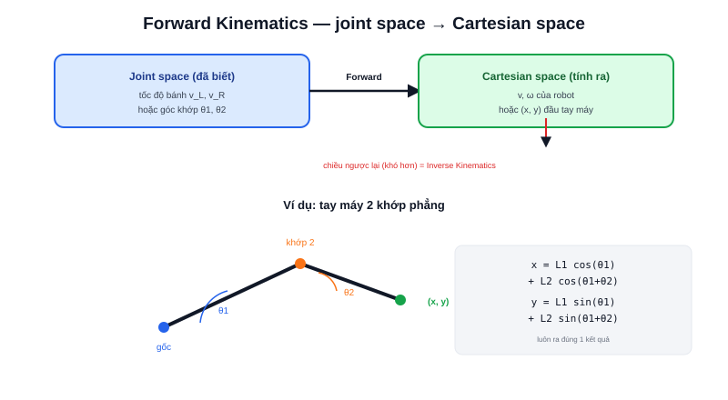

Bài [Differential Drive và Odometry](/blog/dong-hoc-robot-di-chuyen-differential-drive-odometry) đã giải một bài toán forward kinematics cụ thể: biết tốc độ hai bánh, tính ra vận tốc dài/góc của robot. **Forward Kinematics** (động học thuận) là tên gọi chung cho dạng bài toán này, áp dụng cho mọi loại robot có khớp/bánh xe — không chỉ robot di động, còn cả tay máy công nghiệp.



## Định nghĩa chung: không gian khớp → không gian Cartesian

```text
Forward Kinematics:  trạng thái khớp (joint space)  →  vị trí thực tế (Cartesian space)
```

- **Robot di động (wheeled)**: "khớp" là tốc độ quay từng bánh, "vị trí thực tế" là vận tốc dài/góc của cả robot — chính là công thức `v = (v_R + v_L)/2` đã học
- **Tay máy (manipulator)**: "khớp" là góc xoay từng khớp nối (joint angle), "vị trí thực tế" là toạ độ (x, y, z) của đầu công tác (end-effector)

Cả hai đều cùng một dạng bài toán trừu tượng: biết cấu hình từng bộ phận chuyển động riêng lẻ, suy ra vị trí/hướng tổng thể của toàn hệ thống.

## Ví dụ cụ thể: tay máy 2 khớp phẳng (2-link planar arm)

Đây là ví dụ kinh điển nhất để hiểu forward kinematics ngoài robot di động — một cánh tay 2 đoạn, 2 khớp xoay, hoạt động trong mặt phẳng:

```text
θ1 — góc khớp gốc (so với trục x)
θ2 — góc khớp thứ 2 (so với đoạn tay thứ nhất)
L1, L2 — chiều dài hai đoạn tay
```

Vị trí đầu tay máy (x, y) tính trực tiếp bằng lượng giác — ghép nối tiếp hai phép quay (chính là bài Rotation) và tịnh tiến theo từng đoạn:

```text
x = L1 cos(θ1) + L2 cos(θ1 + θ2)
y = L1 sin(θ1) + L2 sin(θ1 + θ2)
```

> **Tóm lại:** Forward kinematics luôn đi **một chiều dễ tính**: biết góc khớp/tốc độ bánh, tính thẳng ra vị trí bằng công thức lượng giác trực tiếp — không cần giải phương trình. Chiều ngược lại (biết muốn robot ở đâu, cần đặt góc khớp/tốc độ bánh bao nhiêu) khó hơn nhiều — đó là bài toán **Inverse Kinematics** (bài tiếp theo).

## Vì sao forward kinematics luôn có đúng một lời giải

Với cùng một bộ giá trị góc khớp/tốc độ bánh đầu vào, vị trí đầu ra luôn tính ra **duy nhất một kết quả** — không có gì mơ hồ, chỉ là thay số vào công thức lượng giác có sẵn. Tính chất "một-lời-giải-duy-nhất" này là điểm khác biệt cốt lõi so với Inverse Kinematics, nơi thường có nhiều (hoặc không có) bộ góc khớp thoả mãn cùng một vị trí đích mong muốn.
