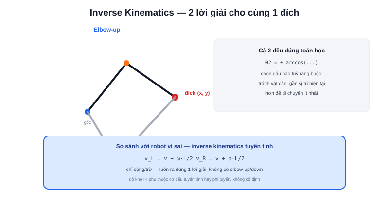

Bài [Forward Kinematics](/blog/forward-kinematics) trả lời "biết góc khớp, vị trí ở đâu?" — một phép tính lượng giác trực tiếp, luôn ra đúng một kết quả. **Inverse Kinematics** (động học nghịch) hỏi ngược lại: "muốn đầu tay máy/robot tới đúng vị trí này, cần đặt góc khớp/tốc độ bánh bao nhiêu?" — và câu trả lời không phải lúc nào cũng đơn giản, thậm chí không phải lúc nào cũng tồn tại.



## Ví dụ tay máy 2 khớp: hai lời giải cho cùng một đích

Tiếp tục ví dụ tay máy 2 đoạn ở bài trước — biết vị trí đích `(x, y)` mong muốn, cần tìm `θ1, θ2`. Dùng định lý hàm cos (law of cosines) trên tam giác tạo bởi hai đoạn tay và đường thẳng tới đích:

```text
r² = x² + y²
cos(θ2) = (r² − L1² − L2²) / (2·L1·L2)
θ2 = ± arccos(...)     ← dấu ± cho 2 lời giải khác nhau
```

Dấu `±` không phải chi tiết vặt — nó phản ánh một sự thật vật lý: **có hai cách đặt khớp khác nhau** để đầu tay máy chạm đúng cùng một điểm `(x, y)` — dân kỹ thuật gọi là cấu hình "elbow-up" và "elbow-down" (khớp giữa gập lên hay gập xuống). Cả hai đều đúng về mặt toán học; chọn cái nào phụ thuộc ràng buộc thực tế (tránh va chạm với vật cản, hoặc gần vị trí hiện tại hơn để di chuyển ít nhất).

> **Tóm lại:** Forward Kinematics luôn cho đúng 1 kết quả vì chỉ là thay số vào công thức. Inverse Kinematics có thể cho **nhiều lời giải** (như ví dụ trên), **đúng 1 lời giải** (trường hợp robot vi sai bên dưới), hoặc **không lời giải nào** (nếu điểm đích nằm ngoài tầm với vật lý của cơ cấu — ví dụ `r > L1 + L2`).

## Trường hợp robot vi sai: inverse kinematics dễ hơn nhiều

Bài [Differential Drive](/blog/dong-hoc-robot-di-chuyen-differential-drive-odometry) thực chất đã dùng đến inverse kinematics mà không gọi tên: biết `v`, `ω` mong muốn (từ bộ điều khiển), suy ngược ra `v_L`, `v_R` cần đặt cho từng bánh — chỉ cần đảo ngược đại số hai phương trình tuyến tính, cho ra **đúng một lời giải duy nhất**, không có trường hợp elbow-up/elbow-down:

```text
v_L = v − ω·L/2
v_R = v + ω·L/2
```

Sự khác biệt căn bản: hệ phương trình forward kinematics của robot vi sai là **tuyến tính** (chỉ cộng/trừ/nhân hệ số cố định), trong khi hệ phương trình của tay máy nhiều khớp thường **phi tuyến** (có sin/cos lồng nhau) — độ khó của inverse kinematics phụ thuộc trực tiếp vào việc cơ cấu đó có bao nhiêu khớp và cấu hình hình học phức tạp tới đâu, không phải một công thức chung cho mọi loại robot.

## Khi không giải được bằng đại số: phương pháp số (numerical IK)

Với tay máy nhiều khớp hơn (5-6 bậc tự do trở lên, phổ biến ở tay máy công nghiệp), giải trực tiếp bằng đại số như ví dụ 2 khớp ở trên trở nên rất phức tạp hoặc bất khả thi. Cách tiếp cận thực tế: dùng thuật toán số lặp dần (ví dụ Jacobian-based, bắt đầu từ một cấu hình khớp bất kỳ, tính sai lệch tới đích, chỉnh dần từng khớp theo hướng giảm sai lệch) — đánh đổi lời giải "đúng tuyệt đối bằng công thức" lấy lời giải "đủ gần đích, tính được trong thời gian thực", đủ dùng cho hầu hết ứng dụng thực tế.
