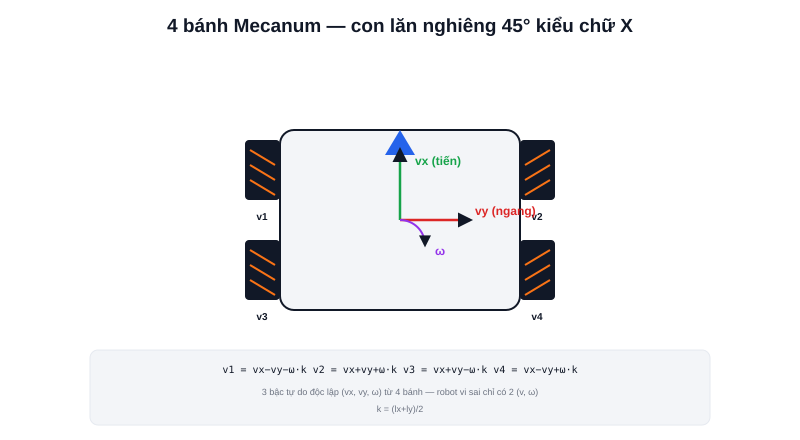

Bài [Differential Drive](/blog/dong-hoc-robot-di-chuyen-differential-drive-odometry) đã nêu rõ hạn chế: robot vi sai không đi ngang được, luôn phải xoay đầu trước khi dịch chuyển sang hướng khác. Bánh **Mecanum** — dùng trong dự án [Robot Mecanum tự hành](/du-an/mecanum-robot) và [Atlas A2](/du-an/atlas-a2) của trang này — giải quyết đúng hạn chế đó, cho phép robot đi ngang, đi chéo, xoay tại chỗ mà không cần xoay thân trước.



## Bí mật nằm ở các con lăn nghiêng 45°

Khác bánh thường (bề mặt tiếp xúc phẳng, chỉ sinh lực theo đúng hướng lăn), bánh Mecanum có hàng loạt con lăn nhỏ gắn nghiêng **45°** quanh vành bánh. Khi bánh quay, lực ma sát tại điểm tiếp xúc **không sinh ra theo hướng lăn của bánh**, mà theo hướng vuông góc với trục con lăn — tức lệch 45° so với hướng quay thông thường.

Bốn bánh Mecanum trên một robot được lắp theo **hai hướng nghiêng đối xứng nhau** (kiểu chữ X nhìn từ trên xuống) — với 4 vector lực lệch 45° khác nhau này, việc phối hợp tốc độ 4 bánh cho phép tổng hợp ra **lực theo bất kỳ hướng nào trong mặt phẳng**, không chỉ tiến/lùi.

## Ba bậc tự do độc lập — thay vì hai

Robot vi sai chỉ điều khiển độc lập được 2 đại lượng (`v`, `ω`) từ 2 bánh. Robot Mecanum với 4 bánh điều khiển độc lập được **3 bậc tự do cùng lúc**: tiến/lùi (`vx`), đi ngang (`vy`), và xoay (`ω`) — đây là ý nghĩa của "omnidirectional" (đa hướng):

```text
v1 = vx − vy − ω·(lx+ly)/2      # bánh trước-trái
v2 = vx + vy + ω·(lx+ly)/2      # bánh trước-phải
v3 = vx + vy − ω·(lx+ly)/2      # bánh sau-trái
v4 = vx − vy + ω·(lx+ly)/2      # bánh sau-phải
```

Trong đó `lx`, `ly` là nửa khoảng cách giữa các bánh theo hai trục. Bốn công thức này là **inverse kinematics** (bài trước) của robot Mecanum — biết vận tốc mong muốn của cả robot (`vx, vy, ω`), suy ra tốc độ cần đặt cho từng bánh riêng lẻ.

> **Tóm lại:** Đổi lại khả năng đi ngang, robot Mecanum phải điều khiển đồng bộ chính xác cả 4 bánh (thay vì 2) — sai lệch nhỏ giữa các bánh (khác biệt ma sát, độ mòn con lăn không đều) gây trượt nhiều hơn robot vi sai, đây là lý do odometry của robot Mecanum trong thực tế thường kém chính xác hơn odometry robot vi sai cùng cỡ.

## Đi ngang thuần tuý — trường hợp đặc biệt dễ hình dung nhất

Đặt `vx = 0`, `ω = 0`, chỉ còn `vy ≠ 0` vào 4 công thức trên:

```text
v1 = −vy      v2 = +vy      v3 = +vy      v4 = −vy
```

Hai bánh chéo nhau quay cùng chiều, hai bánh chéo còn lại quay ngược chiều — không có công thức nào tương tự khả thi với robot vi sai (chỉ 2 bánh, không đủ bậc tự do để tạo chuyển động ngang thuần tuý). Đây chính là điểm khác biệt cơ khí cốt lõi giải thích toàn bộ ưu điểm "đi mọi hướng" của Mecanum.
