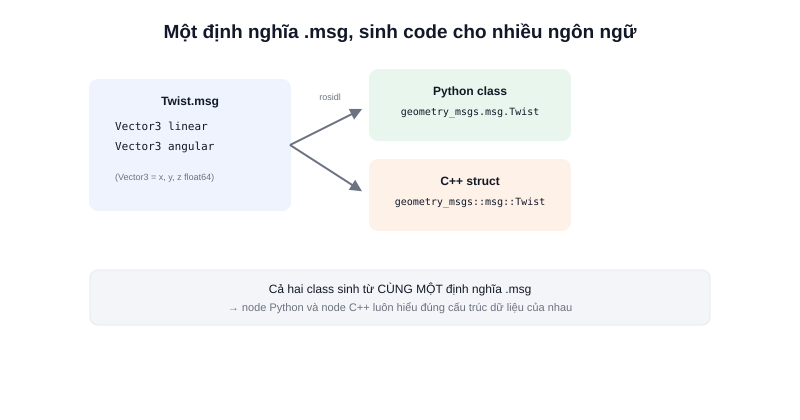

Một topic không truyền "dữ liệu chung chung" — nó truyền đúng một **kiểu message** cố định, được định nghĩa tường minh trước khi biên dịch. Đây là lý do publisher viết bằng C++ và subscriber viết bằng Python vẫn hiểu đúng dữ liệu của nhau: cả hai cùng dùng chung một định nghĩa message, chỉ khác ngôn ngữ sinh code.



## Khái niệm chính

Message được khai báo trong file `.msg` — cú pháp cực đơn giản, mỗi dòng là `kiểu_dữ_liệu tên_trường`:

```text
# geometry_msgs/Twist.msg
Vector3 linear
Vector3 angular
```

```text
# geometry_msgs/Vector3.msg
float64 x
float64 y
float64 z
```

Message có thể **lồng nhau** — `Twist` chứa hai `Vector3` bên trong, mỗi `Vector3` lại có 3 trường số thực. Các kiểu cơ bản có sẵn: `int32`, `float64`, `string`, `bool`, `bool[]` (mảng)... đủ để ghép thành hầu hết cấu trúc dữ liệu robot cần.

### Message được biên dịch thành class thật

Khi build package, công cụ sinh code của ROS2 tự động đọc file `.msg` và **sinh ra class tương ứng** trong từng ngôn ngữ (Python, C++) — không cần viết tay struct/class thủ công, và không sợ hai bên định nghĩa lệch nhau vì cả hai cùng sinh ra từ một nguồn `.msg` duy nhất.

> **Tóm lại:** File `.msg` là "hợp đồng" mô tả hình dạng dữ liệu — publisher và subscriber dù viết bằng ngôn ngữ nào cũng phải tuân theo đúng hợp đồng đó, đảm bảo không bao giờ hiểu sai cấu trúc dữ liệu của nhau.

## Nguyên lý hoạt động

```text
Twist.msg (định nghĩa)
       ↓  biên dịch lúc build (rosidl)
  Python: geometry_msgs.msg.Twist
  C++:    geometry_msgs::msg::Twist
       ↓
   Dùng trong code như một class/struct bình thường
```

Tạo và điền dữ liệu vào một message trong Python:

```python
from geometry_msgs.msg import Twist

msg = Twist()
msg.linear.x = 0.2    # truy cập trường lồng nhau như thuộc tính object
msg.angular.z = 0.1
publisher.publish(msg)
```

Xem cấu trúc đầy đủ của bất kỳ kiểu message nào (kể cả message từ package của người khác) mà không cần mở file `.msg` thủ công:

```bash
ros2 interface show geometry_msgs/msg/Twist
```
