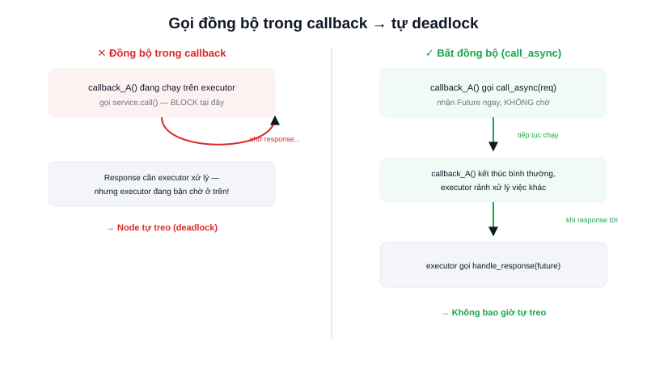

Bài "Service trong ROS2 là gì?" đã giới thiệu mô hình request-response cơ bản. Nhưng có một chi tiết quan trọng thường bị bỏ qua: **gọi service theo kiểu đồng bộ (blocking) ngay bên trong một callback khác** là một trong những lỗi phổ biến nhất khiến node ROS2 tự "treo" mà không rõ nguyên nhân.



## Khái niệm chính

Client gọi service có hai kiểu:

- **Đồng bộ (blocking)** — gọi xong, code dừng lại chờ tới khi có response mới chạy tiếp
- **Bất đồng bộ (async)** — gọi xong, nhận về một **Future** (đối tượng đại diện cho "kết quả sẽ có trong tương lai"), code tiếp tục chạy ngay, xử lý response khi nó thực sự tới thông qua callback riêng

### Vì sao gọi đồng bộ bên trong callback dễ gây treo node

Executor mặc định của ROS2 thường xử lý các callback (timer, subscriber, service...) của một node **tuần tự trên cùng một luồng**. Nếu bên trong một callback đang chạy, code gọi service theo kiểu blocking và ngồi chờ response — nhưng response đó lại cần được chính executor của node này xử lý (ví dụ gọi chính service do node đó cung cấp, hoặc phụ thuộc một callback khác chưa tới lượt chạy) — kết quả là node **tự chờ chính mình**, không bao giờ thoát ra được. Đây là lý do ROS2 khuyến nghị mạnh mẽ dùng **gọi bất đồng bộ (`call_async`)** thay vì gọi đồng bộ ở hầu hết trường hợp, khác với thói quen phổ biến hơn ở ROS1.

> **Tóm lại:** Gọi service đồng bộ chỉ an toàn khi chắc chắn đang ở ngoài executor (ví dụ trong hàm `main()` của một script độc lập) — bên trong bất kỳ callback nào của node, luôn ưu tiên `call_async` kèm xử lý kết quả qua callback riêng.

## Nguyên lý hoạt động

File `.srv` định nghĩa cả request lẫn response, phân tách bằng dòng `---`:

```text
# AddTwoInts.srv
int64 a
int64 b
---
int64 sum
```

Gọi service bất đồng bộ đúng cách — không block, xử lý kết quả qua callback riêng khi Future hoàn tất:

```python
future = self.client.call_async(request)
future.add_done_callback(self.handle_response)  # được gọi khi có response, không chờ tại đây

def handle_response(self, future):
    response = future.result()
    self.get_logger().info(f'Kết quả: {response.sum}')
```

```text
call_async(request)
       ↓
  trả về ngay 1 Future — code tiếp tục chạy, KHÔNG chờ
       ↓  (khi response thực sự tới)
  executor tự gọi handle_response(future)
```

Kiểm tra một service đang cung cấp kiểu request/response gì mà không cần đọc file `.srv`:

```bash
ros2 interface show example_interfaces/srv/AddTwoInts
```
