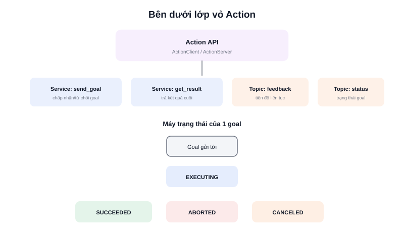

Bài "Action trong ROS2 là gì?" đã giới thiệu mô hình goal → feedback → result. Điều thú vị là Action **không phải một giao thức hoàn toàn mới** — nó được xây dựng bằng cách ghép lại chính những cơ chế đã học: Service và Topic.



## Khái niệm chính

Nhìn dưới lớp vỏ, một Action thực chất tạo ra:

- **2 Service** — `send_goal` (client gửi goal, server trả về chấp nhận hay từ chối) và `get_result` (client hỏi kết quả cuối, server trả về khi đã xong)
- **1 Topic feedback** — server liên tục publish tiến độ lên đây, client subscribe để nhận
- **1 Topic status** — server publish trạng thái hiện tại của goal (đang chờ, đang chạy, đã huỷ...)

Việc đóng gói sẵn 4 kênh giao tiếp này thành một API thống nhất (`ActionClient`/`ActionServer`) giúp người dùng không phải tự ghép thủ công — chỉ cần định nghĩa một file `.action` duy nhất.

### Máy trạng thái của một goal

Mỗi goal gửi tới action server trải qua các trạng thái rõ ràng, do action server quản lý:

```text
Goal gửi tới
     ↓
Server chấp nhận? ──Không──► REJECTED
     │ Có
     ▼
  EXECUTING ──────────────► CANCELING (nếu client gọi cancel)
     │                            │
     ▼                            ▼
SUCCEEDED / ABORTED          CANCELED
```

> **Tóm lại:** Action không phải "công nghệ mới" — nó là cách ROS2 đóng gói một mẫu thiết kế (pattern) thường gặp — tác vụ dài, có tiến độ, có thể huỷ — từ đúng những viên gạch Topic và Service đã có sẵn, cộng thêm một máy trạng thái để quản lý vòng đời goal cho gọn gàng.

## Nguyên lý hoạt động

File `.action` định nghĩa cả 3 phần goal/result/feedback trong một file, phân tách bằng `---`:

```text
# NavigateToPose.action
geometry_msgs/PoseStamped pose      # Goal
---
std_msgs/Empty result                # Result
---
geometry_msgs/PoseStamped current_pose   # Feedback
float32 distance_remaining
```

Gửi goal và huỷ giữa chừng bằng code Python:

```python
goal_handle = await action_client.send_goal_async(goal_msg, feedback_callback=on_feedback)

# ... một lúc sau, muốn huỷ giữa chừng
if muon_huy:
    await goal_handle.cancel_goal_async()   # chuyển goal sang trạng thái CANCELING
```

Trong thực tế, `NavigateToPose` chính là action mà **Nav2** cung cấp để nhận lệnh "di chuyển robot tới một điểm" — mỗi khi đặt goal trên RViz, đằng sau đó là đúng luồng gửi goal → nhận feedback vị trí hiện tại liên tục → nhận result khi robot tới đích (hoặc bị huỷ nếu người dùng đặt goal mới đè lên goal cũ).
