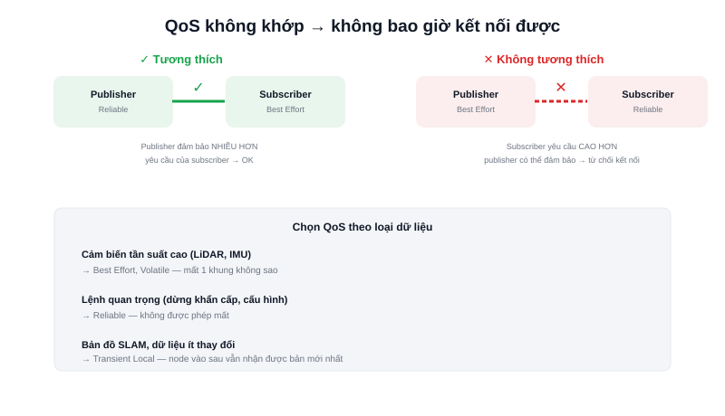

Có một lớp lỗi ROS2 khiến người mới bối rối nhất: `ros2 topic list` thấy topic tồn tại, `ros2 node info` thấy cả publisher lẫn subscriber đều đã đăng ký đúng topic — nhưng subscriber **không bao giờ nhận được dữ liệu**. Nguyên nhân rất có thể nằm ở **QoS không tương thích**.



## Khái niệm chính

QoS (Quality of Service) là tập hợp các "chính sách" cấu hình **cách** dữ liệu được truyền trên một topic — ROS2 kế thừa khả năng này từ DDS (xem bài riêng), khác hẳn ROS1 vốn chỉ có một cách truyền cố định qua TCP. Bốn chính sách quan trọng nhất:

| Chính sách | Lựa chọn | Ý nghĩa |
|---|---|---|
| **Reliability** | Reliable | Đảm bảo gửi lại nếu mất gói — chậm hơn nhưng không mất dữ liệu |
| | Best Effort | Gửi 1 lần, mất thì thôi — nhanh hơn, phù hợp dữ liệu tần suất cao |
| **Durability** | Volatile | Subscriber vào sau bỏ lỡ các message đã publish trước đó |
| | Transient Local | Subscriber vào sau vẫn nhận được message cuối cùng đã publish |
| **History** | Keep Last (N) | Chỉ giữ N message gần nhất trong hàng đợi |
| | Keep All | Giữ toàn bộ (giới hạn bởi bộ nhớ) |

### Vì sao publisher và subscriber phải "khớp" QoS

DDS có quy tắc **tương thích (compatibility)**: một số tổ hợp QoS giữa publisher và subscriber sẽ **không bao giờ kết nối được**, dù cả hai cùng đúng tên topic và kiểu message. Ví dụ kinh điển: publisher cấu hình `Best Effort`, subscriber yêu cầu `Reliable` — DDS coi đây là yêu cầu subscriber không thể đáp ứng được với những gì publisher cung cấp, và từ chối ghép nối hoàn toàn, âm thầm, không có lỗi hiển thị rõ ràng.

> **Tóm lại:** Dữ liệu cảm biến tần suất cao (LiDAR, IMU) thường dùng Best Effort — mất một khung dữ liệu không sao, khung tiếp theo tới ngay sau đó. Dữ liệu quan trọng không được phép mất (lệnh dừng khẩn cấp, cấu hình) nên dùng Reliable. Cấu hình sai loại cho đúng dữ liệu là nguồn lỗi "không nhận được gì" phổ biến nhất khi mới học ROS2.

## Nguyên lý hoạt động

Cấu hình QoS tường minh khi tạo publisher/subscriber trong Python:

```python
from rclpy.qos import QoSProfile, ReliabilityPolicy, DurabilityPolicy

qos = QoSProfile(
    reliability=ReliabilityPolicy.BEST_EFFORT,   # dữ liệu LiDAR tần suất cao
    durability=DurabilityPolicy.VOLATILE,
    depth=5
)
self.create_subscription(LaserScan, '/scan', self.callback, qos)
```

Nhiều package (như bản đồ từ SLAM) publish với QoS `Transient Local` — vì bản đồ chỉ cập nhật không thường xuyên, node khởi động sau (như RViz2 mở lên sau khi SLAM đã chạy được một lúc) vẫn cần nhận được bản đồ mới nhất ngay lập tức thay vì phải chờ tới lần publish tiếp theo.

Kiểm tra nhanh QoS thực tế của một topic đang chạy để debug khi nghi ngờ lệch cấu hình:

```bash
ros2 topic info /scan --verbose
```
