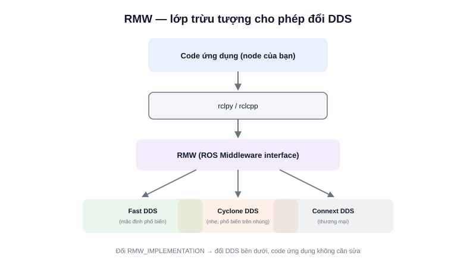

Những bài trước đã nhắc nhiều lần: ROS2 không cần `roscore`, hỗ trợ QoS linh hoạt, các node tự tìm thấy nhau. Toàn bộ những khả năng này **không phải ROS2 tự phát minh** — chúng đến từ **DDS (Data Distribution Service)**, một chuẩn middleware pub/sub công nghiệp đã tồn tại từ trước ROS2 rất lâu, dùng trong hàng không, quốc phòng, tài chính.



## Khái niệm chính

Thay vì tự viết một giao thức mạng riêng (như ROS1 từng làm với TCPROS), nhóm phát triển ROS2 chọn xây dựng trên nền DDS có sẵn — thừa hưởng luôn hai đặc tính cốt lõi:

- **Discovery phân tán** — mỗi tiến trình DDS tự quảng bá sự hiện diện của mình lên mạng (qua multicast), các bên tự tìm thấy nhau mà không cần một "danh bạ trung tâm" nào — chính là lý do ROS2 không cần `roscore`
- **QoS có thể cấu hình** — DDS định nghĩa sẵn hàng chục chính sách QoS (Reliability, Durability, History...), ROS2 chỉ expose lại một tập con dễ dùng qua API của mình (xem bài QoS)

### RMW — lớp trừu tượng cho phép đổi DDS

ROS2 không khoá cứng vào một hãng DDS cụ thể. Lớp **RMW (ROS Middleware interface)** đứng giữa thư viện client (`rclcpp`/`rclpy`) và DDS thực tế bên dưới, cho phép cắm thay đổi giữa nhiều triển khai khác nhau (Fast DDS, Cyclone DDS, Connext...) mà code ứng dụng không cần sửa gì — chỉ cần đổi biến môi trường `RMW_IMPLEMENTATION`.

> **Tóm lại:** ROS2 = thư viện client (`rclpy`/`rclcpp`) + RMW (lớp trừu tượng) + một triển khai DDS cụ thể chạy bên dưới. Hiểu DDS giải thích được vì sao ROS2 không cần trạm trung tâm, và vì sao QoS lại linh hoạt tới vậy — cả hai đều là đặc tính vốn có của DDS, không phải ROS2 tự chế.

## Nguyên lý hoạt động

```text
   Code ứng dụng (node của bạn)
              │
        rclpy / rclcpp
              │
             RMW   ← lớp trừu tượng, có thể đổi triển khai
              │
   ┌──────────┼──────────┐
Fast DDS   Cyclone DDS  Connext DDS   ← chọn 1 trong nhiều triển khai
```

Kiểm tra và đổi triển khai DDS đang dùng:

```bash
echo $RMW_IMPLEMENTATION            # xem đang dùng triển khai nào (mặc định thường là Fast DDS)
export RMW_IMPLEMENTATION=rmw_cyclonedds_cpp   # đổi sang Cyclone DDS
```

Một khái niệm thực tế hay gặp: **`ROS_DOMAIN_ID`** — số hiệu "kênh" cô lập các mạng ROS2 khác nhau đang chạy chung một mạng vật lý (ví dụ hai robot trong cùng phòng thí nghiệm, mỗi robot một domain ID riêng để không "nhìn thấy" node của nhau, tránh xung đột hoặc tự động tương tác không mong muốn) — đây trực tiếp là một cơ chế của DDS, ROS2 chỉ expose lại qua biến môi trường.
