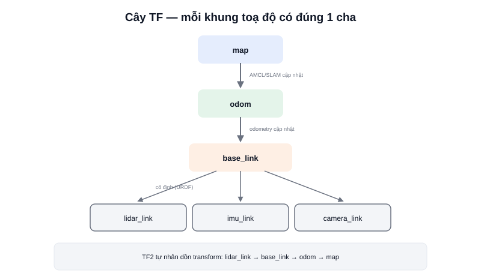

Một robot AMR có rất nhiều "khung toạ độ" (coordinate frame) khác nhau cùng tồn tại: khung của LiDAR (gắn trên đầu robot, cách tâm robot 20cm), khung của chính robot (`base_link`, di chuyển trên sàn), khung bản đồ tổng thể (`map`, cố định). Khi LiDAR đo được một vật cản "cách LiDAR 2m về phía trước", câu hỏi thực sự cần trả lời là: **vật cản đó nằm ở đâu trên bản đồ?** — đây chính xác là bài toán **TF2** giải quyết.



## Khái niệm chính

TF2 (Transform Library, phiên bản 2) theo dõi vị trí và hướng **tương đối** giữa các khung toạ độ theo thời gian, tổ chức chúng thành một **cây (tree)** — mỗi khung có đúng **một khung cha**, không có vòng lặp. Cấu trúc phổ biến trên một AMR:

```text
map
 └── odom
      └── base_link
           ├── lidar_link
           ├── imu_link
           └── camera_link
```

- **map → odom** — do hệ định vị toàn cục (AMCL, SLAM) cập nhật, sửa lại sai số trôi (drift) của odometry theo thời gian
- **odom → base_link** — do node tính odometry cập nhật liên tục, dựa trên dữ liệu encoder/IMU
- **base_link → lidar_link/imu_link/camera_link** — thường **cố định**, xác định bởi vị trí lắp đặt vật lý thật của từng cảm biến trên khung robot (khai báo trong URDF, không đổi theo thời gian)

### Broadcaster và Listener

Node nào biết quan hệ giữa hai khung sẽ đóng vai **broadcaster**, liên tục publish transform lên hệ thống TF2. Node nào cần biết "điểm A ở khung X đang nằm đâu trong khung Y" đóng vai **listener**, gọi hàm tra cứu — TF2 tự động **nhân dồn (chain)** các transform trung gian nếu hai khung không nối trực tiếp, ví dụ tính từ `lidar_link` ra tới `map` phải đi qua đủ `lidar_link → base_link → odom → map`.

> **Tóm lại:** Không có TF2, mỗi node sẽ phải tự làm phép tính hình học quy đổi toạ độ thủ công giữa mọi cặp khung nó cần — rất dễ sai và không thể tái sử dụng. TF2 chuẩn hoá việc này thành một dịch vụ tra cứu chung cho toàn hệ thống.

## Nguyên lý hoạt động

Phát transform tĩnh giữa `base_link` và `lidar_link` (LiDAR lắp cố định, cách tâm robot 0,1m theo trục X):

```bash
ros2 run tf2_ros static_transform_publisher 0.1 0 0.15 0 0 0 base_link lidar_link
```

Tra cứu transform giữa hai khung bất kỳ, kể cả khi không nối trực tiếp — TF2 tự tính chuỗi trung gian:

```python
from tf2_ros import Buffer, TransformListener

tf_buffer = Buffer()
listener = TransformListener(tf_buffer, self)

transform = tf_buffer.lookup_transform('map', 'lidar_link', rclpy.time.Time())
# TF2 tự nhân dồn: lidar_link → base_link → odom → map
```

Xem trực quan toàn bộ cây TF hiện tại của hệ thống — công cụ debug gần như bắt buộc khi robot "hành xử lạ" (vật cản hiện sai vị trí, bản đồ lệch):

```bash
ros2 run tf2_tools view_frames    # xuất ra file PDF vẽ toàn bộ cây TF
```

Lỗi TF2 phổ biến nhất là **"tra cứu quá khứ/tương lai quá xa" (extrapolation error)** — xảy ra khi listener hỏi transform tại một mốc thời gian mà broadcaster chưa kịp publish (hoặc đã publish quá lâu trước đó), thường do hai node chạy lệch tần suất hoặc đồng hồ hệ thống không đồng bộ.
