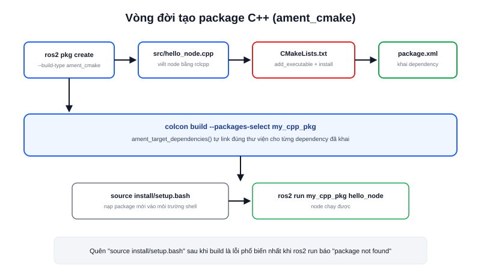

Bài [Package trong ROS2 là gì?](/blog/package) đã giới thiệu khái niệm `ament_cmake`. Bài này đi vào thao tác cụ thể: tạo một package C++ hoàn chỉnh, từ `ros2 pkg create` đến chạy được node đầu tiên bằng `ros2 run`.



## Tạo khung package

Đứng trong thư mục `src/` của workspace, dùng `ros2 pkg create` với `--build-type ament_cmake`:

```bash
cd ~/ros2_ws/src
ros2 pkg create --build-type ament_cmake my_cpp_pkg \
  --dependencies rclcpp std_msgs
```

Cờ `--dependencies` không chỉ ghi chú — nó tự động điền các dòng `find_package()` vào `CMakeLists.txt` và `<depend>` vào `package.xml` tương ứng, đỡ phải sửa tay hai file này ngay từ đầu.

Kết quả sinh ra:

```text
my_cpp_pkg/
├── CMakeLists.txt      ← khai cách biên dịch (xem bài riêng)
├── package.xml         ← khai dependency (xem bài riêng)
├── include/my_cpp_pkg/ ← header .hpp nếu tách riêng
└── src/                ← file .cpp thực tế
```

## Viết node tối thiểu

Tạo `src/my_cpp_pkg/src/hello_node.cpp`:

```cpp
#include "rclcpp/rclcpp.hpp"

int main(int argc, char **argv) {
  rclcpp::init(argc, argv);
  auto node = std::make_shared<rclcpp::Node>("hello_node");
  RCLCPP_INFO(node->get_logger(), "hello_node đã khởi động");
  rclcpp::spin(node);
  rclcpp::shutdown();
  return 0;
}
```

### Khai executable trong CMakeLists.txt

Khác với Python (khai trong `setup.py`), package C++ khai executable trực tiếp trong `CMakeLists.txt`:

```cmake
add_executable(hello_node src/hello_node.cpp)
ament_target_dependencies(hello_node rclcpp)

install(TARGETS hello_node
  DESTINATION lib/${PROJECT_NAME})
```

`ament_target_dependencies()` là hàm tiện ích của `ament_cmake` — tự link đúng thư viện, đúng include path cho từng dependency đã khai ở `find_package()`, thay vì phải tự viết `target_link_libraries()` thủ công cho từng gói.

> **Tóm lại:** Với C++, "khai executable" nằm ở `CMakeLists.txt` (`add_executable` + `install`), khác hẳn Python nơi việc này nằm ở `setup.py` (`entry_points`) — đây là khác biệt lớn nhất giữa hai loại package khi thao tác thực tế.

## Build và chạy

```bash
cd ~/ros2_ws
colcon build --packages-select my_cpp_pkg
source install/setup.bash
ros2 run my_cpp_pkg hello_node
```

`--packages-select` giới hạn build đúng 1 package thay vì build lại cả workspace — hữu ích khi workspace đã có hàng chục package và bạn chỉ vừa sửa một cái. Nếu quên `source install/setup.bash` sau khi build, `ros2 run` sẽ báo không tìm thấy package dù build đã thành công — lỗi rất hay gặp với người mới.
