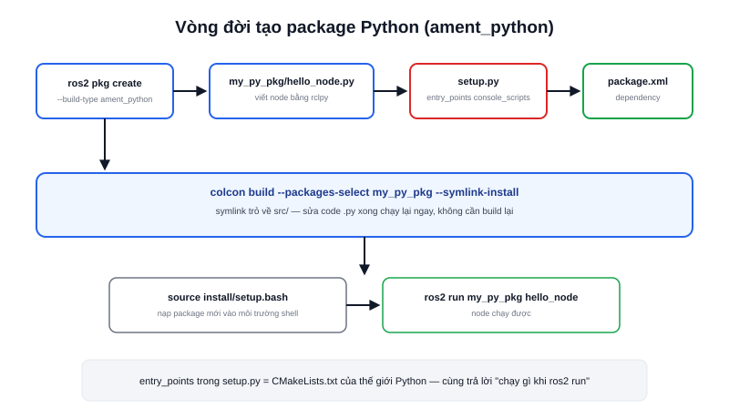

Song song với bài [Tạo package C++](/blog/tao-package-cpp), đây là quy trình tương đương cho `ament_python` — kiểu package phổ biến cho các node xử lý logic cấp cao (state machine, gọi API, xử lý ảnh bằng OpenCV) nơi tốc độ phát triển quan trọng hơn hiệu năng thuần.



## Tạo khung package

```bash
cd ~/ros2_ws/src
ros2 pkg create --build-type ament_python my_py_pkg \
  --dependencies rclpy std_msgs
```

Cấu trúc sinh ra khác C++ ở chỗ có `setup.py`/`setup.cfg` thay cho `CMakeLists.txt`, và thư mục code trùng tên package thay vì `src/`:

```text
my_py_pkg/
├── package.xml
├── setup.py             ← khai cách cài đặt + executable
├── setup.cfg
├── resource/my_py_pkg   ← file đánh dấu package (ament index)
└── my_py_pkg/
    └── __init__.py
```

## Viết node và khai entry_points

Tạo `my_py_pkg/hello_node.py`:

```python
import rclpy
from rclpy.node import Node

def main(args=None):
    rclpy.init(args=args)
    node = Node("hello_node")
    node.get_logger().info("hello_node đã khởi động")
    rclpy.spin(node)
    rclpy.shutdown()

if __name__ == "__main__":
    main()
```

Khác với C++ (khai executable trong `CMakeLists.txt`), Python khai trong `setup.py`, mục `entry_points`:

```python
entry_points={
    "console_scripts": [
        "hello_node = my_py_pkg.hello_node:main",
    ],
},
```

Cú pháp `"tên_lệnh = module.file:hàm"` — vế trái là tên bạn gõ sau `ros2 run my_py_pkg`, vế phải là đường dẫn Python thực tới hàm `main()` cần gọi.

> **Tóm lại:** `entry_points` trong `setup.py` chính là "CMakeLists.txt của thế giới Python" — cả hai đều trả lời cùng một câu hỏi: chạy `ros2 run <package> <tên>` thì thực thi file/hàm nào.

## Build và chạy — mẹo symlink-install

```bash
cd ~/ros2_ws
colcon build --packages-select my_py_pkg --symlink-install
source install/setup.bash
ros2 run my_py_pkg hello_node
```

Cờ `--symlink-install` chỉ có ý nghĩa với package Python: thay vì copy file `.py` vào `install/`, `colcon` tạo symlink trỏ ngược về `src/`. Kết quả là sửa code Python xong **chạy lại được ngay**, không cần `colcon build` lại — vì có build lại hay không, Python cũng không biên dịch gì cả, chỉ đơn giản là đọc đúng file nguồn. Với C++ thì bắt buộc phải build lại vì cần biên dịch ra binary mới.
