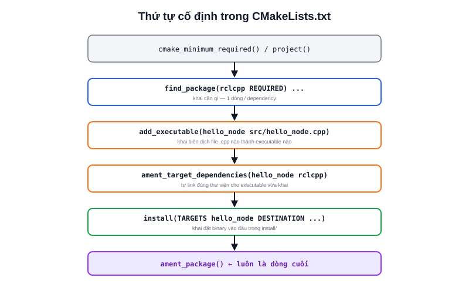

Mở `CMakeLists.txt` của một package `ament_cmake` bất kỳ lần đầu thường thấy rối vì nhiều dòng lệnh lạ. Thực tế phần lớn package chỉ lặp lại 5-6 khối lệnh theo đúng thứ tự cố định — nắm được khuôn này là đọc hiểu (và sửa) được hầu hết `CMakeLists.txt` trong hệ sinh thái ROS2.



## Khối lệnh theo đúng thứ tự

```cmake
cmake_minimum_required(VERSION 3.8)
project(my_cpp_pkg)

find_package(ament_cmake REQUIRED)
find_package(rclcpp REQUIRED)
find_package(std_msgs REQUIRED)

add_executable(hello_node src/hello_node.cpp)
ament_target_dependencies(hello_node rclcpp std_msgs)

install(TARGETS hello_node
  DESTINATION lib/${PROJECT_NAME})

ament_package()
```

- **`cmake_minimum_required` / `project()`** — khai tên project, bắt buộc với mọi file CMake chuẩn, không riêng ROS2
- **`find_package(... REQUIRED)`** — tìm và nạp từng dependency đã khai ở `package.xml`; thiếu dòng này cho dependency nào thì build sẽ báo lỗi "package not found" ngay cả khi package đó đã cài trên máy
- **`add_executable()`** — khai một file `.cpp` sẽ được biên dịch thành binary, đặt tên executable (tên dùng với `ros2 run`)
- **`ament_target_dependencies()`** — tự động link đúng thư viện + include path cho executable vừa khai, dựa theo các `find_package()` ở trên — thay thế cho `target_link_libraries()`/`target_include_directories()` thuần CMake mà bạn phải tự viết nếu không dùng `ament_cmake`
- **`install()`** — khai nơi copy file kết quả vào thư mục `install/` của workspace, để `ros2 run`/`ros2 launch` tìm thấy được
- **`ament_package()`** — **luôn là dòng cuối cùng**, đăng ký package vào hệ thống ament (sinh các file cần thiết để package khác `find_package()` được nó)

> **Tóm lại:** Thứ tự cố định là find_package (khai cần gì) → add_executable (khai biên dịch gì) → ament_target_dependencies (khai link gì) → install (khai đặt ở đâu) → ament_package (chốt lại). Sai thứ tự — ví dụ install() một executable chưa được add_executable() — sẽ báo lỗi CMake ngay khi build.

## Thêm nhiều executable, hoặc thêm thư viện

Một package có nhiều node chỉ cần lặp lại cặp `add_executable` + `ament_target_dependencies` + liệt kê thêm trong `install(TARGETS ...)`:

```cmake
add_executable(node_a src/node_a.cpp)
ament_target_dependencies(node_a rclcpp)

add_executable(node_b src/node_b.cpp)
ament_target_dependencies(node_b rclcpp std_msgs)

install(TARGETS node_a node_b
  DESTINATION lib/${PROJECT_NAME})
```

Nếu có code dùng chung giữa nhiều node (ví dụ một class helper), tách thành thư viện riêng bằng `add_library()` rồi cho từng executable link vào, tránh biên dịch trùng lặp cùng một đoạn code nhiều lần.

## Lỗi thường gặp

| Triệu chứng | Nguyên nhân |
|---|---|
| `Could not find a package configuration file for "X"` | Thiếu `find_package(X REQUIRED)`, hoặc package X chưa cài/chưa source đúng workspace |
| `undefined reference to ...` khi link | Thiếu tên thư viện trong `ament_target_dependencies()` dù đã `find_package()` |
| `ros2 run` báo không thấy executable dù build "thành công" | Thiếu executable đó trong `install(TARGETS ...)` |
