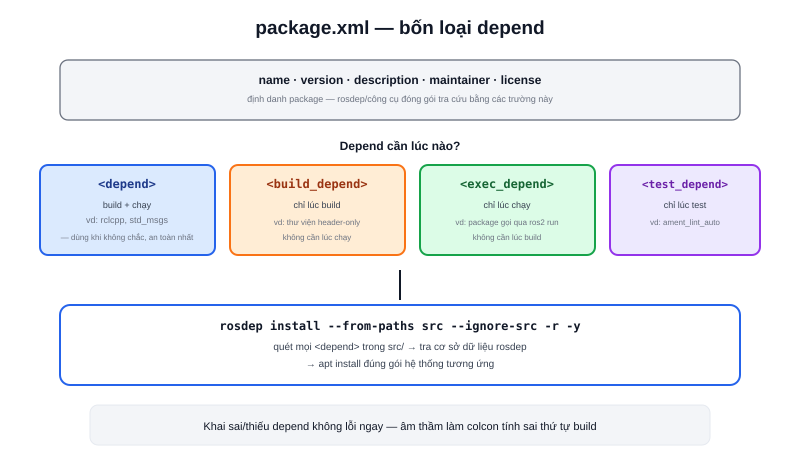

Trong hai file cấu hình của một package (`CMakeLists.txt`/`setup.py` và `package.xml`), `package.xml` là file **duy nhất bắt buộc với mọi package**, bất kể C++ hay Python. Đây là bản khai để `colcon`, `rosdep` và các công cụ ROS2 khác hiểu package của bạn là gì và cần gì để chạy.



## Các thẻ bắt buộc

```xml
<?xml version="1.0"?>
<package format="3">
  <name>my_cpp_pkg</name>
  <version>0.0.1</version>
  <description>Package mẫu minh hoạ package.xml</description>
  <maintainer email="you@example.com">Tên bạn</maintainer>
  <license>Apache-2.0</license>

  <buildtool_depend>ament_cmake</buildtool_depend>

  <depend>rclcpp</depend>
  <depend>std_msgs</depend>

  <test_depend>ament_lint_auto</test_depend>

  <export>
    <build_type>ament_cmake</build_type>
  </export>
</package>
```

- **`name` / `version` / `description` / `maintainer` / `license`** — thông tin định danh, `rosdep`/công cụ đóng gói dùng để tra cứu
- **`buildtool_depend`** — công cụ build cần dùng (`ament_cmake` hoặc `ament_python`), khớp với `--build-type` lúc `ros2 pkg create`
- **`export> <build_type>`** — dòng này là thứ thực sự quyết định `colcon` build package theo kiểu nào, phải khớp với `buildtool_depend` ở trên

## Ba loại depend hay nhầm lẫn

| Thẻ | Khi nào cần | Ví dụ |
|---|---|---|
| `<depend>` | Dùng lúc build **và** lúc chạy | `rclcpp`, `std_msgs` |
| `<build_depend>` | Chỉ cần lúc build, không cần lúc chạy | thư viện header-only chỉ dùng để biên dịch |
| `<exec_depend>` | Chỉ cần lúc chạy, không cần lúc build | một node Python gọi package khác qua `ros2 run`, không link tĩnh |
| `<test_depend>` | Chỉ cần khi chạy test | `ament_lint_auto`, `ament_cmake_gtest` |

Phần lớn trường hợp thực tế chỉ cần `<depend>` — nó tương đương khai cả `build_depend` lẫn `exec_depend` cùng lúc, dùng an toàn khi không chắc dependency đó cần ở giai đoạn nào.

> **Tóm lại:** `<depend>` sai hoặc thiếu không làm `CMakeLists.txt`/`setup.py` báo lỗi ngay — nó âm thầm làm `colcon build` tính sai thứ tự build giữa các package, hoặc khiến `rosdep install` bỏ sót một thư viện hệ thống cần cài. Đây là lý do package.xml nên khai đầy đủ ngay từ đầu, không để "sau tính sau".

## rosdep dùng package.xml để cài dependency hệ thống

```bash
cd ~/ros2_ws
rosdep install --from-paths src --ignore-src -r -y
```

Lệnh này quét toàn bộ `package.xml` trong `src/`, tra cứu từng `<depend>` trong cơ sở dữ liệu `rosdep` để biết cần cài gói hệ thống nào (qua `apt`) tương ứng — cách chuẩn để cài đủ dependency cho một workspace mới clone về, thay vì đoán và cài `apt install` thủ công từng cái.
