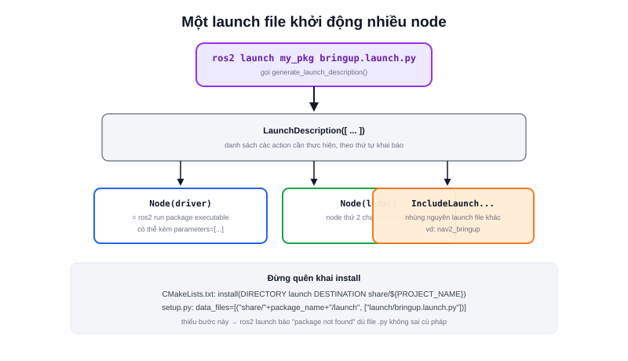

Robot Mecanum hay Diff Robot trong phần showcase dự án đều chạy song song nhiều node: driver động cơ, LiDAR, SLAM, Nav2... Mở từng terminal gõ `ros2 run` cho từng node là không thực tế. **Launch file** giải quyết đúng vấn đề này — khai báo toàn bộ node cần chạy, kèm tham số, trong một file Python, khởi động bằng một lệnh `ros2 launch`.



## Launch file tối thiểu

Đặt trong thư mục `launch/` của package, ví dụ `launch/bringup.launch.py`:

```python
from launch import LaunchDescription
from launch_ros.actions import Node

def generate_launch_description():
    return LaunchDescription([
        Node(
            package="my_cpp_pkg",
            executable="hello_node",
            name="hello_node",
            output="screen",
        ),
        Node(
            package="my_py_pkg",
            executable="hello_node",
            name="hello_node_py",
            output="screen",
        ),
    ])
```

Chạy bằng:

```bash
ros2 launch my_cpp_pkg bringup.launch.py
```

Hàm bắt buộc phải tên `generate_launch_description()` — đây là điểm vào (entry point) mà `ros2 launch` tìm và gọi. Mỗi phần tử `Node(...)` tương đương một lần gõ `ros2 run <package> <executable>` thủ công.

### Đưa launch file vào CMakeLists.txt/setup.py

Chỉ viết file thôi chưa đủ — phải khai `install` để launch file được copy vào `install/` lúc build:

```cmake
install(DIRECTORY launch
  DESTINATION share/${PROJECT_NAME})
```

Với package Python, tương đương trong `setup.py`:

```python
data_files=[
    ("share/" + package_name + "/launch",
     ["launch/bringup.launch.py"]),
],
```

> **Tóm lại:** Quên khai `install(DIRECTORY launch ...)` (C++) hoặc `data_files` (Python) là lỗi rất hay gặp — code Python launch file đúng cú pháp nhưng `ros2 launch` báo "package 'X' not found" vì file chưa từng được copy vào `install/`.

## Truyền tham số và include launch file khác

```python
from launch.actions import DeclareLaunchArgument, IncludeLaunchDescription
from launch.launch_description_sources import PythonLaunchDescriptionSource
from launch.substitutions import LaunchConfiguration
from launch import LaunchDescription
from launch_ros.actions import Node

def generate_launch_description():
    use_sim = DeclareLaunchArgument("use_sim", default_value="false")

    driver_node = Node(
        package="my_cpp_pkg",
        executable="hello_node",
        parameters=[{"use_sim": LaunchConfiguration("use_sim")}],
    )

    nav2 = IncludeLaunchDescription(
        PythonLaunchDescriptionSource(["/path/to/nav2_bringup/launch/bringup_launch.py"])
    )

    return LaunchDescription([use_sim, driver_node, nav2])
```

- **`DeclareLaunchArgument`** — khai một tham số dòng lệnh cho chính launch file (`ros2 launch my_pkg bringup.launch.py use_sim:=true`)
- **`IncludeLaunchDescription`** — nhúng nguyên một launch file khác vào — cách chuẩn để "lắp ráp" launch file lớn (ví dụ bringup toàn hệ thống) từ nhiều launch file nhỏ của từng package con, thay vì copy dán lại toàn bộ node

## Bảng tổng hợp action hay dùng

| Action | Dùng để |
|---|---|
| `Node` | Chạy một executable ROS2 |
| `DeclareLaunchArgument` | Khai tham số dòng lệnh cho launch file |
| `IncludeLaunchDescription` | Nhúng launch file khác |
| `TimerAction` | Trì hoãn chạy một action sau N giây |
| `LogInfo` | In log ra terminal lúc launch |
