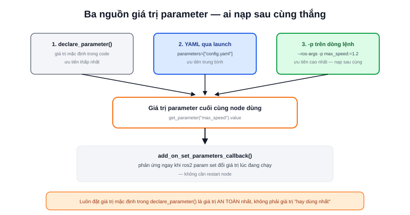

Một node điều khiển động cơ viết cứng `max_speed = 0.5` trong code thì mỗi lần đổi robot (hoặc chỉ đơn giản là muốn thử tốc độ khác) đều phải sửa code, build lại. **Parameter** giải quyết đúng việc này: khai giá trị cấu hình bên ngoài code, node đọc vào lúc chạy — đổi giá trị chỉ cần sửa file YAML hoặc gõ một cờ dòng lệnh, không cần build lại.



## Khai báo và đọc parameter trong code

```python
import rclpy
from rclpy.node import Node

class MotorNode(Node):
    def __init__(self):
        super().__init__("motor_node")
        self.declare_parameter("max_speed", 0.5)
        max_speed = self.get_parameter("max_speed").value
        self.get_logger().info(f"max_speed = {max_speed}")
```

`declare_parameter(tên, giá_trị_mặc_định)` **bắt buộc phải gọi trước** khi đọc — ROS2 chủ động yêu cầu khai báo tường minh (khác ROS1 cho phép đọc parameter bất kỳ không cần khai trước) để tránh lỗi gõ nhầm tên parameter mà không hay biết.

## Ba cách nạp giá trị, theo thứ tự ưu tiên

```yaml
# config/motor_params.yaml
motor_node:
  ros__parameters:
    max_speed: 0.8
    frame_id: "base_link"
```

```python
# Trong launch file
Node(
    package="my_pkg",
    executable="motor_node",
    parameters=["config/motor_params.yaml"],
)
```

```bash
# Ghi đè nhanh từ dòng lệnh, không cần sửa file YAML
ros2 run my_pkg motor_node --ros-args -p max_speed:=1.2
```

Giá trị cuối cùng node nhận được là giá trị **được nạp sau cùng** — nếu cả launch file lẫn dòng lệnh `-p` cùng set `max_speed`, cờ `-p` trên dòng lệnh thắng vì chạy sau. Đây là cơ chế hữu ích khi debug: không cần sửa file YAML hay launch file chỉ để thử nhanh một giá trị.

> **Tóm lại:** Giá trị mặc định trong `declare_parameter()` là lớp phòng hờ cuối cùng nếu không file YAML/launch nào ghi đè — nên luôn đặt mặc định là giá trị an toàn nhất (ví dụ tốc độ thấp), không phải giá trị "thường dùng nhất".

## Callback khi parameter đổi lúc đang chạy

```python
from rcl_interfaces.msg import SetParametersResult

def parameter_callback(self, params):
    for p in params:
        if p.name == "max_speed":
            self.get_logger().info(f"max_speed đổi thành {p.value}")
    return SetParametersResult(successful=True)

# Trong __init__:
self.add_on_set_parameters_callback(self.parameter_callback)
```

Callback này cho phép node phản ứng ngay khi ai đó gọi `ros2 param set` (xem bài riêng về công cụ này) mà **không cần restart node** — ví dụ đổi ngưỡng cảm biến hoặc bật/tắt một chế độ ngay trong lúc robot đang chạy.
