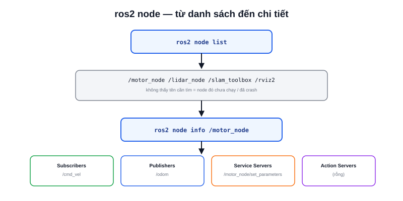

Robot đang chạy nhưng không rõ node điều khiển động cơ có thực sự khởi động hay không, hay đã crash âm thầm — `ros2 node` là lệnh đầu tiên nên gõ trước khi đi sâu vào debug topic/service.



## Các lệnh chính

```bash
ros2 node list
```

In ra tên đầy đủ (kèm namespace) của mọi node đang chạy trong cùng `ROS_DOMAIN_ID`. Không thấy tên node cần tìm trong danh sách này nghĩa là node đó chưa chạy hoặc đã crash — không cần đi tìm nguyên nhân ở đâu xa hơn.

```bash
ros2 node info /motor_node
```

Với một node cụ thể, lệnh này liệt kê đầy đủ:

- **Subscribers** — topic node đang lắng nghe
- **Publishers** — topic node đang phát ra
- **Service Servers/Clients** — service node cung cấp/gọi
- **Action Servers/Clients** — action tương tự

> **Tóm lại:** `ros2 node info` là cách nhanh nhất để trả lời "node này thực sự đang kết nối với những gì" mà không cần đọc lại source code — hữu ích nhất khi debug một node của người khác hoặc một package đã lâu không đụng tới.

## Ví dụ đọc kết quả

```text
$ ros2 node info /motor_node
/motor_node
  Subscribers:
    /cmd_vel: geometry_msgs/msg/Twist
  Publishers:
    /odom: nav_msgs/msg/Odometry
    /rosout: rcl_interfaces/msg/Log
  Service Servers:
    /motor_node/set_parameters: rcl_interfaces/srv/SetParameters
  Service Clients:

  Action Servers:

  Action Clients:
```

Đọc nhanh: node này nhận lệnh vận tốc qua `/cmd_vel`, phát odometry qua `/odom`. Nếu robot không di chuyển khi gửi lệnh, bước tiếp theo hợp lý là kiểm tra `/cmd_vel` có publisher nào thật sự gửi dữ liệu tới không (xem bài `ros2 topic`) — không phải đoán mò trong code.
