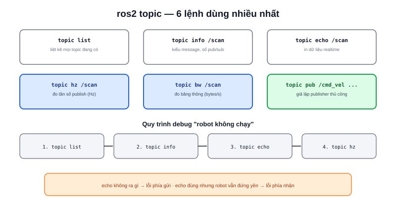

Khi hai node "đáng lẽ" phải nói chuyện với nhau qua topic nhưng không thấy hoạt động đúng, `ros2 topic` là nhóm lệnh trả lời được phần lớn câu hỏi: dữ liệu có tới không, tới bao nhiêu Hz, và giả lập dữ liệu để test node còn lại mà không cần chạy đủ cả hệ thống.



## Bảng lệnh chính

| Lệnh | Mục đích |
|---|---|
| `ros2 topic list` | Liệt kê mọi topic đang có |
| `ros2 topic echo /cmd_vel` | In dữ liệu topic ra terminal theo thời gian thực |
| `ros2 topic info /cmd_vel` | Xem kiểu message, số publisher/subscriber |
| `ros2 topic hz /scan` | Đo tần số publish thực tế (Hz) |
| `ros2 topic bw /scan` | Đo băng thông (bytes/giây) topic đang chiếm |
| `ros2 topic pub /cmd_vel geometry_msgs/msg/Twist "{...}"` | Publish thủ công một message |

## Debug "robot không di chuyển" bằng ros2 topic

Quy trình thực tế thường theo đúng thứ tự:

```bash
ros2 topic list | grep cmd_vel        # topic /cmd_vel có tồn tại không?
ros2 topic info /cmd_vel               # có publisher nào không?
ros2 topic echo /cmd_vel               # dữ liệu gửi tới có đúng như kỳ vọng?
ros2 topic hz /cmd_vel                 # tần số publish có quá thấp không?
```

Nếu `ros2 topic echo` không in ra gì dù đang gửi lệnh điều khiển, vấn đề nằm ở phía gửi (node điều khiển chưa publish, hoặc publish sai tên topic). Nếu echo ra đúng dữ liệu nhưng robot vẫn đứng yên, vấn đề chuyển sang phía nhận (node driver động cơ) — `ros2 topic` giúp khoanh vùng lỗi về đúng một phía trước khi mở code lên đọc.

> **Tóm lại:** `ros2 topic echo` + `ros2 topic hz` là cặp lệnh dùng nhiều nhất trong debug hằng ngày — echo trả lời "có đúng dữ liệu không", hz trả lời "có đúng tốc độ không". Rất nhiều lỗi robot "giật cục" hoá ra là do tần số publish quá thấp, không phải lỗi logic.

## Publish thủ công để test node nhận

```bash
ros2 topic pub /cmd_vel geometry_msgs/msg/Twist \
  "{linear: {x: 0.2}, angular: {z: 0.0}}" --rate 10
```

Lệnh này giả lập một publisher gửi lệnh "tiến thẳng 0.2 m/s" ở tần số 10Hz — hữu ích để test node nhận `/cmd_vel` (driver động cơ) có phản ứng đúng hay không, mà **không cần** chạy cả hệ thống điều hướng (Nav2, teleop...) phía trên. `--rate 10` giữ lệnh publish liên tục; bỏ cờ này thì chỉ gửi đúng một lần rồi dừng.
