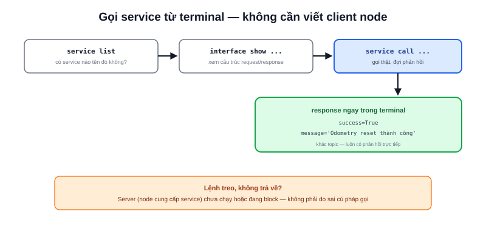

Một service `/reset_odometry` hay `/set_mode` chỉ dùng thử vài lần khi debug — viết hẳn một client node cho việc này là phí thời gian. `ros2 service` cho phép gọi trực tiếp từ terminal, không cần viết dòng code nào.



## Các lệnh chính

```bash
ros2 service list                    # liệt kê mọi service đang có
ros2 service type /reset_odometry    # xem kiểu service (request/response gì)
ros2 service call /reset_odometry std_srvs/srv/Trigger
```

Với service có tham số đầu vào phức tạp hơn `Trigger` (vốn không cần tham số), gõ thêm phần request dạng YAML:

```bash
ros2 service call /set_mode my_msgs/srv/SetMode "{mode: 'auto'}"
```

## Không nhớ format request? Để tab-complete tự điền

```bash
ros2 interface show my_msgs/srv/SetMode
```

Lệnh này in ra đúng cấu trúc field của service (phần request phía trên dấu `---`, response phía dưới) — tra trước khi gọi `ros2 service call` để biết chính xác cần điền field nào, tránh đoán mò. Terminal ROS2 cũng hỗ trợ nhấn Tab sau khi gõ tên service để tự động điền sẵn khung YAML rỗng đúng kiểu.

> **Tóm lại:** Khác với topic (fire-and-forget, không đảm bảo ai nhận), service luôn có phản hồi ngay trong terminal sau khi gọi — nếu lệnh treo không trả về, gần như chắc chắn server phía node cung cấp service đó chưa chạy hoặc đang bị block ở đâu đó, không phải do cú pháp câu lệnh gọi sai.

## Ví dụ thực tế: reset odometry giữa lúc test

```bash
$ ros2 service call /reset_odometry std_srvs/srv/Trigger
waiting for service to become available...
requester: making request: std_srvs.srv.Trigger_Request()

response:
std_srvs.srv.Trigger_Response(success=True, message='Odometry reset thành công')
```

Đây là cách nhanh nhất để reset odometry giữa các lần chạy thử SLAM mà không cần restart toàn bộ node — miễn là package đã có sẵn service này (nhiều package robot thực tế đều expose các service tiện ích kiểu này cho đúng mục đích debug nhanh).
