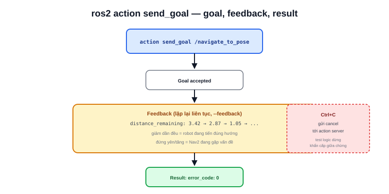

Action (như `/navigate_to_pose` của Nav2) khác service ở chỗ chạy lâu và có feedback dọc đường — `ros2 action` là cách test một action server mà không cần dựng UI, đặc biệt hữu ích khi debug Nav2 qua SSH, không có màn hình để mở RViz2.



## Các lệnh chính

```bash
ros2 action list                     # liệt kê action server đang có
ros2 action info /navigate_to_pose   # xem client/server đang kết nối
ros2 action send_goal /navigate_to_pose nav2_msgs/action/NavigateToPose \
  "{pose: {header: {frame_id: 'map'}, pose: {position: {x: 1.0, y: 2.0}}}}"
```

`send_goal` gửi một goal thật tới action server, sau đó **giữ terminal mở** để in feedback liên tục cho tới khi action hoàn tất hoặc bị huỷ (Ctrl+C) — khác `service call` chỉ đợi đúng một phản hồi rồi kết thúc ngay.

## Đọc feedback trong khi action đang chạy

```text
$ ros2 action send_goal /navigate_to_pose nav2_msgs/action/NavigateToPose "{...}" --feedback
Goal accepted with ID: 8f3a...

Feedback:
    current_pose: ...
    distance_remaining: 3.42

Feedback:
    current_pose: ...
    distance_remaining: 2.87
...
Result:
    error_code: 0
```

Cờ `--feedback` bật in từng gói feedback theo thời gian thực — với `NavigateToPose`, quan sát `distance_remaining` giảm dần đều là dấu hiệu robot đang di chuyển đúng hướng; nếu con số đứng yên hoặc tăng, Nav2 đang gặp vấn đề (kẹt, không lập được đường đi) trước cả khi cần mở RViz2 để nhìn trực quan.

> **Tóm lại:** Action = service (có phản hồi cuối) + topic (feedback liên tục dọc đường) + khả năng huỷ giữa chừng — ba đặc điểm mà `send_goal --feedback` cho phép kiểm chứng cả ba ngay từ terminal, không cần bất kỳ giao diện đồ hoạ nào.

## Huỷ goal đang chạy

```bash
ros2 action send_goal ... # Ctrl+C để huỷ goal đang chờ kết quả
```

Nhấn Ctrl+C trong lúc `send_goal` đang chờ sẽ gửi yêu cầu huỷ (cancel) goal đó tới server — hành vi tương đương khi Nav2 nhận lệnh dừng khẩn cấp giữa lúc đang điều hướng, đúng luồng cần test khi kiểm tra logic recovery/an toàn của hệ thống.
