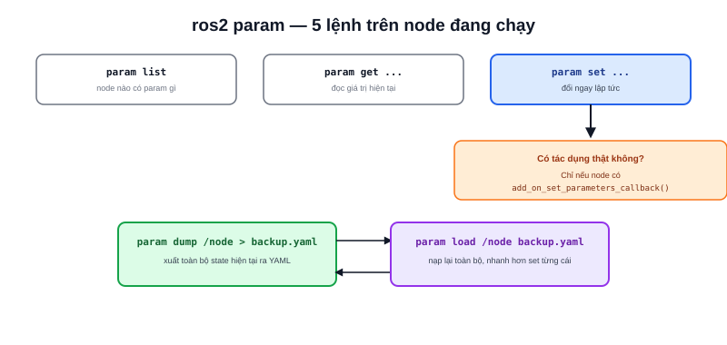

Bài [Parameter trong ROS2](/blog/parameter) đã giải thích cách khai báo parameter trong code. Đây là bộ công cụ dòng lệnh thao tác với parameter đó **sau khi node đã chạy** — không cần sửa code hay restart.



## Các lệnh chính

```bash
ros2 param list                          # node nào có parameter gì
ros2 param get /motor_node max_speed     # đọc giá trị hiện tại
ros2 param set /motor_node max_speed 1.2 # đổi giá trị ngay lập tức
ros2 param dump /motor_node              # xuất toàn bộ ra YAML
ros2 param load /motor_node config.yaml  # nạp lại từ file YAML
```

`ros2 param set` chỉ có tác dụng thật sự nếu node đã đăng ký `add_on_set_parameters_callback()` (xem bài Parameter) — với node không đăng ký callback này, giá trị parameter vẫn đổi trong hệ thống nhưng code node **không hề hay biết** để phản ứng, dễ gây hiểu lầm "đã set nhưng không có tác dụng gì".

> **Tóm lại:** `ros2 param set` đổi giá trị ngay lập tức không cần restart node — nhưng chỉ hữu ích nếu node thực sự lắng nghe thay đổi đó trong code. Set xong không thấy hiệu ứng gì, việc đầu tiên cần kiểm tra là node có `add_on_set_parameters_callback` hay không, không phải nghi ngờ lệnh `set` sai.

## dump/load — sao lưu cấu hình đang chạy

```bash
ros2 param dump /motor_node > motor_backup.yaml
```

Hữu ích khi đang tinh chỉnh nhiều parameter bằng `set` liên tục (ví dụ đang tune PID trực tiếp lúc robot chạy) và tìm được bộ giá trị ưng ý — `dump` xuất toàn bộ state hiện tại ra file YAML đúng định dạng dùng lại được trong launch file, không cần chép tay từng giá trị đã gõ qua `set`.

```bash
ros2 param load /motor_node motor_backup.yaml
```

Ngược lại, `load` nạp lại toàn bộ file YAML vào node đang chạy — nhanh hơn nhiều so với `set` từng parameter một khi cần khôi phục về một bộ cấu hình đã lưu trước đó.
