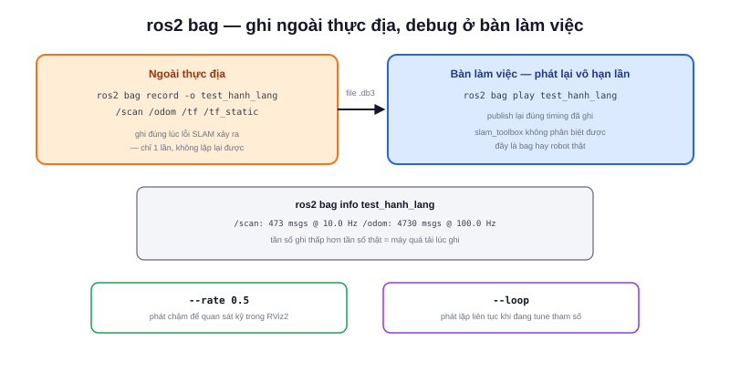

Một lỗi SLAM chỉ xuất hiện khi robot đi qua đúng một góc hành lang cụ thể ngoài thực địa — quay lại hiện trường để tái hiện lỗi mỗi lần debug là không thực tế. `ros2 bag` ghi lại toàn bộ dữ liệu topic (LiDAR, odometry, TF...) của lần chạy đó thành file, sau này phát lại y hệt ngay tại bàn làm việc, bao nhiêu lần cũng được.



## Ghi và phát lại

```bash
ros2 bag record -o test_hanh_lang /scan /odom /tf /tf_static
```

`-o test_hanh_lang` đặt tên thư mục output. Chỉ nên ghi đúng những topic cần debug (ở đây là `/scan`, `/odom`, `/tf`) — ghi `-a` (tất cả topic) dễ tạo file khổng lồ không cần thiết nếu hệ thống có topic ảnh/video nặng.

```bash
ros2 bag play test_hanh_lang
```

Lệnh này phát lại đúng dữ liệu đã ghi, publish lại lên đúng các topic gốc theo đúng timing đã ghi — với các node đang subscribe (ví dụ `slam_toolbox`), dữ liệu bag trông **y hệt** dữ liệu robot thật đang chạy, không cần biết nguồn là bag hay robot.

> **Tóm lại:** `ros2 bag` biến một lỗi khó tái hiện ngoài thực địa thành một file có thể phát lại vô hạn lần ở bàn làm việc — đây là công cụ quan trọng nhất để debug SLAM/Nav2 một cách có hệ thống, thay vì "đoán rồi thử lại ngoài thực địa" từng lần.

## Xem thông tin bag đã ghi

```bash
ros2 bag info test_hanh_lang
```

```text
Files:             test_hanh_lang_0.db3
Duration:          47.3s
Messages:          14208
Topic information:
  /scan      : 473 msgs @ 10.0 Hz
  /odom      : 4730 msgs @ 100.0 Hz
  /tf        : 9005 msgs
```

Đọc nhanh: nếu `/scan` chỉ ghi được 5Hz thay vì tần số LiDAR thực tế 10Hz, khả năng cao là chính lúc ghi bag máy đã quá tải (CPU không đọc kịp), một manh mối quan trọng cần biết trước khi kết luận bug nằm ở thuật toán SLAM.

## Phát lại chậm hoặc lặp để debug kỹ

```bash
ros2 bag play test_hanh_lang --rate 0.5   # phát chậm một nửa tốc độ
ros2 bag play test_hanh_lang --loop       # lặp lại liên tục
```

`--rate 0.5` hữu ích khi cần quan sát kỹ từng khung dữ liệu bằng RViz2 (xem bài riêng) mà tốc độ gốc quá nhanh để nhìn theo kịp; `--loop` giữ dữ liệu phát lặp vô hạn, tiện khi đang tinh chỉnh tham số SLAM và muốn thấy hiệu ứng ngay mà không phải gõ lại lệnh play mỗi lần.
