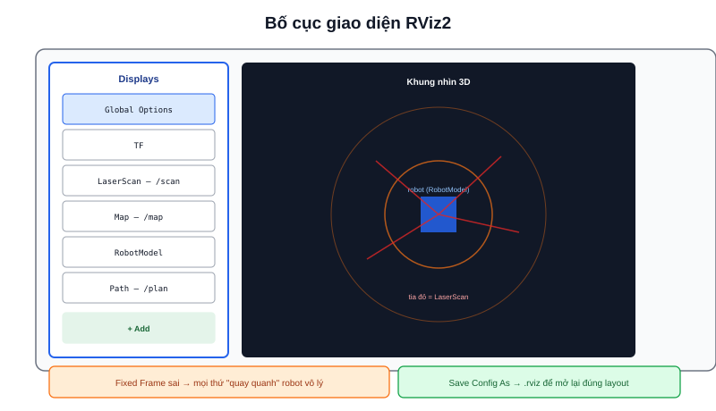

Các bài trước dùng `ros2 topic echo` để xem dữ liệu dạng số — nhưng "robot có đang đứng đúng vị trí trên bản đồ không" hay "đám mây điểm LiDAR có khớp với tường thật không" là câu hỏi chỉ trả lời được bằng hình ảnh. **RViz2** là công cụ 3D chính thức của ROS2 để trực quan hoá mọi loại dữ liệu robot cùng lúc.



## Khởi động và khái niệm Fixed Frame

```bash
rviz2
```

Việc đầu tiên sau khi mở RViz2 luôn là chọn **Fixed Frame** (góc trên bên trái, panel Global Options) — đây là hệ toạ độ tham chiếu mà mọi dữ liệu khác được vẽ so với nó. Chọn sai Fixed Frame (ví dụ chọn `base_link` — hệ toạ độ gắn liền thân robot — thay vì `map` hay `odom`) khiến bản đồ/quỹ đạo trông như đang "quay quanh" robot một cách vô lý, dù dữ liệu gốc hoàn toàn đúng.

> **Tóm lại:** Trước khi nghi ngờ dữ liệu sai, luôn kiểm tra Fixed Frame trước — phần lớn cảnh "robot vẽ linh tinh trong RViz2" của người mới là do chọn nhầm Fixed Frame, không phải lỗi thuật toán.

## Thêm Display cho từng loại dữ liệu

Nút **Add** ở panel Displays (trái) mở danh sách loại hiển thị, chọn theo loại topic cần xem:

| Display | Dùng để xem |
|---|---|
| `LaserScan` | Dữ liệu quét LiDAR (`/scan`) |
| `TF` | Toàn bộ cây hệ toạ độ, trực quan hoá quan hệ frame–frame |
| `Map` | Bản đồ occupancy grid (`/map`) từ SLAM |
| `RobotModel` | Mô hình 3D robot theo URDF, di chuyển đúng theo TF thật |
| `Path` | Đường đi đã lập kế hoạch (`/plan` từ Nav2) |
| `Odometry` | Quỹ đạo đã đi qua, dựng từ `/odom` |

Cách nhanh hơn "Add theo loại": tab **By topic** liệt kê sẵn các topic đang publish, chọn thẳng topic cần xem — RViz2 tự suy ra loại Display phù hợp.

## Debug TF bằng RViz2

Thêm Display `TF` là cách nhanh nhất phát hiện lỗi cấu hình hệ toạ độ — một frame "trôi" lơ lửng không nối với cây TF chính (thường do thiếu static transform publisher), hoặc hai frame chồng lên nhau sai vị trí, đều hiện rõ bằng mắt thường ngay khi bật Display này, nhanh hơn nhiều so với đọc `ros2 topic echo /tf` dạng số thô.

## Lưu cấu hình để dùng lại

RViz2 cho phép lưu toàn bộ layout (Displays đã thêm, Fixed Frame, góc nhìn camera) ra file `.rviz` (File → Save Config As). Launch file của một package robot thường tự mở kèm sẵn file `.rviz` riêng:

```python
Node(
    package="rviz2",
    executable="rviz2",
    arguments=["-d", "/path/to/nav2_default_view.rviz"],
)
```

Nhờ vậy mỗi lần bringup không cần tự thêm lại từng Display bằng tay — RViz2 mở lên đã đúng sẵn góc nhìn và các lớp dữ liệu cần thiết cho việc giám sát Nav2/SLAM.
