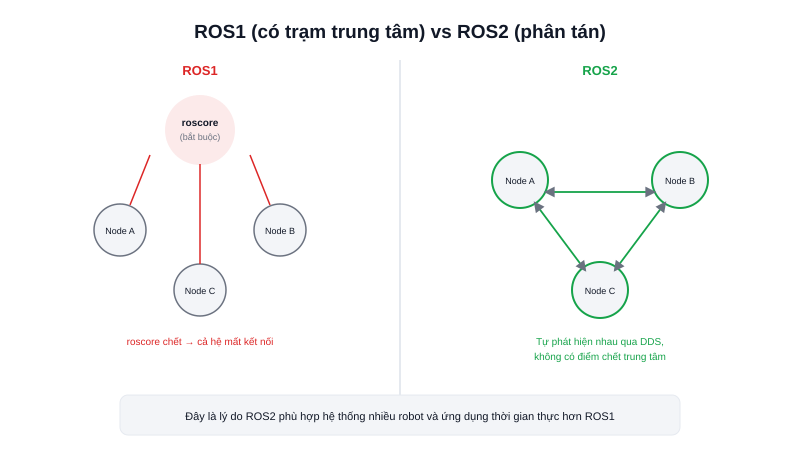

Cái tên "Robot Operating System" (ROS) khiến nhiều người mới nhầm tưởng đây là một hệ điều hành thay thế Linux/Windows — thực ra không phải vậy. **ROS2** chạy **trên** Ubuntu như một phần mềm bình thường, đóng vai trò **middleware**: lớp trung gian giúp hàng chục tiến trình độc lập trên robot (đọc LiDAR, chạy SLAM, điều khiển động cơ, tính đường đi...) nói chuyện được với nhau theo một chuẩn thống nhất.



## Khái niệm chính

Một hệ thống robot thực tế không chạy trong một chương trình duy nhất — nó là tập hợp nhiều **node** (tiến trình nhỏ, mỗi node làm đúng một việc), cần trao đổi dữ liệu liên tục với nhau. ROS2 cung cấp sẵn:

- Cơ chế giao tiếp chuẩn hoá giữa các node (**topic**, **service**, **action** — xem các bài riêng)
- Công cụ dòng lệnh để quan sát/debug hệ thống đang chạy (`ros2 topic list`, `ros2 node list`...)
- Hệ sinh thái package có sẵn khổng lồ: Nav2 (điều hướng), SLAM Toolbox/Cartographer (dựng bản đồ), driver cho hầu hết LiDAR/camera/động cơ phổ biến
- Hỗ trợ đa ngôn ngữ (C++ qua `rclcpp`, Python qua `rclpy`) — các node viết bằng ngôn ngữ khác nhau vẫn giao tiếp bình thường

### ROS2 khác ROS1 ở điểm nào

Khác biệt lớn nhất: ROS1 cần một tiến trình trung tâm gọi là `roscore` — mọi node phải đăng ký qua đó mới tìm thấy nhau, nếu `roscore` chết thì cả hệ thống mất kết nối. ROS2 bỏ hẳn khái niệm này, chuyển sang mô hình **phân tán (decentralized)** dựa trên **DDS** (Data Distribution Service — xem bài riêng): các node tự "quảng bá" sự tồn tại của mình trên mạng, không phụ thuộc một điểm chết duy nhất.

> **Tóm lại:** ROS2 là bộ công cụ + giao thức giao tiếp chuẩn hoá cho phần mềm robot, không phải hệ điều hành — chạy trên Ubuntu, giúp nhiều node độc lập phối hợp thành một hệ thống hoàn chỉnh mà không cần một "trạm trung tâm" duy nhất.

## Nguyên lý hoạt động

```text
     ┌──────────────┐        topic         ┌──────────────┐
     │  Node LiDAR  │ ───────────────────► │  Node SLAM   │
     └──────────────┘                       └──────┬───────┘
                                                     │ topic (bản đồ)
                                                     ▼
     ┌──────────────┐        service        ┌──────────────┐
     │ Node điều    │ ◄─────────────────────│  Node Nav2   │
     │ khiển động cơ│                        └──────────────┘
     └──────────────┘
```

Mỗi mũi tên trên là một kết nối được thiết lập tự động khi hai node cùng "khai báo" quan tâm tới cùng một topic/service — không cần cấu hình địa chỉ IP hay port thủ công. Toàn bộ đồ thị giao tiếp này (gọi là **ROS graph**) có thể xem trực quan bằng lệnh `rqt_graph`, công cụ debug đầu tiên hầu như ai cũng dùng khi mới bắt đầu với ROS2.
