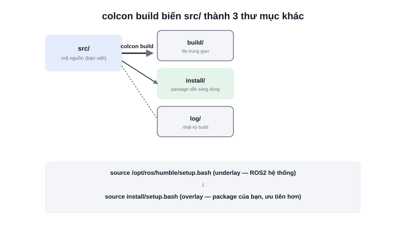

Trước khi viết node ROS2 đầu tiên, việc cần làm luôn là tạo một **workspace** — thư mục làm việc có cấu trúc chuẩn, nơi mã nguồn các package của bạn được đặt vào, biên dịch, và cài đặt để dùng được trong hệ thống.



## Khái niệm chính

Một workspace ROS2 tối thiểu chỉ cần một thư mục `src/` chứa mã nguồn các package. Sau khi build bằng công cụ **colcon**, ba thư mục khác được tự động sinh ra:

```text
ros2_ws/
├── src/       ← mã nguồn package (bạn viết/clone vào đây)
├── build/     ← file trung gian sinh ra khi biên dịch
├── install/   ← package đã build xong, sẵn sàng dùng
└── log/       ← log của lần build gần nhất
```

Chỉ có `src/` là thứ bạn thực sự chỉnh sửa bằng tay — `build/`, `install/`, `log/` đều do `colcon build` tự sinh ra và có thể xoá đi build lại bất cứ lúc nào mà không mất mã nguồn.

### Underlay và Overlay

ROS2 hệ thống (cài qua `apt install ros-humble-desktop`) cũng là một dạng workspace đã build sẵn, gọi là **underlay**. Workspace bạn tự tạo để phát triển package riêng gọi là **overlay** — khi "source" (nạp môi trường) cả hai theo đúng thứ tự, overlay sẽ ưu tiên đè lên underlay nếu có package trùng tên, cho phép vừa dùng package hệ thống có sẵn vừa phát triển package của riêng mình song song.

> **Tóm lại:** Workspace không phải khái niệm ROS2 đặc thù khó hiểu — nó chỉ là một thư mục theo đúng quy ước để `colcon` biết đâu là mã nguồn cần build, và đâu là kết quả build ra để dùng.

## Nguyên lý hoạt động

```bash
mkdir -p ~/ros2_ws/src        # Tạo workspace, chỉ cần thư mục src
cd ~/ros2_ws
colcon build                  # Build toàn bộ package trong src/
source install/setup.bash     # Nạp môi trường overlay vào shell hiện tại
```

Sau bước `source`, các package vừa build (và mọi node bên trong chúng) trở thành "nhìn thấy được" với `ros2 run`, `ros2 launch` trong đúng terminal đó. Đây là lý do một lỗi rất phổ biến với người mới là **quên `source install/setup.bash`** sau mỗi lần mở terminal mới hoặc sau mỗi lần build lại — node build xong nhưng `ros2 run` báo "không tìm thấy package" vì terminal đó chưa nạp lại overlay mới nhất.
