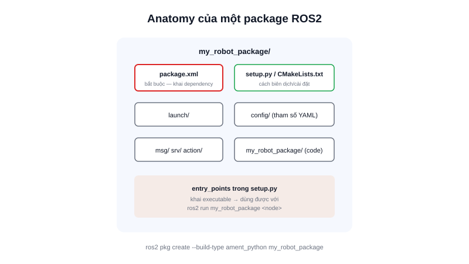

Mọi thứ trong ROS2 — một node điều khiển động cơ, một launch file khởi động cả hệ thống, một bộ file cấu hình Nav2 — đều phải nằm bên trong một **package**. Đây là đơn vị đóng gói nhỏ nhất mà `colcon build` hiểu và biết cách biên dịch/cài đặt.



## Khái niệm chính

Một package ROS2 tối thiểu cần một file bắt buộc: **`package.xml`** — bản khai (manifest) mô tả tên, phiên bản, tác giả, và quan trọng nhất là **danh sách các package khác mà nó phụ thuộc** (dependencies). Nhờ khai báo này, khi build cả workspace, `colcon` tự biết cần build package nào trước, package nào sau theo đúng thứ tự phụ thuộc.

### Hai kiểu package: ament_cmake và ament_python

- **ament_python** — dùng cho package viết bằng Python, cần thêm file `setup.py`/`setup.cfg`
- **ament_cmake** — dùng cho package viết bằng C++ (hoặc pha trộn C++/Python), cần thêm file `CMakeLists.txt` mô tả cách biên dịch

Cấu trúc thư mục con bên trong thường theo quy ước chung dù kiểu nào: `launch/` (launch file), `config/` (file tham số YAML), `msg/`/`srv/`/`action/` (định nghĩa kiểu dữ liệu tự khai báo, nếu có), và mã nguồn thực tế (`src/` cho C++, thư mục trùng tên package cho Python).

> **Tóm lại:** `package.xml` là "chứng minh thư" của package — khai đúng dependency ở đây giúp `colcon build` tự lo phần thứ tự build, không cần bạn tự nhớ package nào phải build trước.

## Nguyên lý hoạt động

Tạo một package Python mới trong workspace bằng công cụ có sẵn, không cần gõ tay từng file:

```bash
cd ~/ros2_ws/src
ros2 pkg create --build-type ament_python my_robot_package
```

Lệnh trên tự sinh cấu trúc chuẩn:

```text
my_robot_package/
├── package.xml           ← khai tên, phụ thuộc
├── setup.py               ← khai cách cài đặt (Python)
├── setup.cfg
├── resource/my_robot_package
└── my_robot_package/      ← thư mục chứa code Python thực tế
    └── __init__.py
```

Sau khi thêm code node vào thư mục cùng tên package, khai executable trong `setup.py` (`entry_points`), rồi build lại từ thư mục gốc workspace (`colcon build`) — package mới có thể chạy được ngay bằng `ros2 run my_robot_package <tên_node>`.
