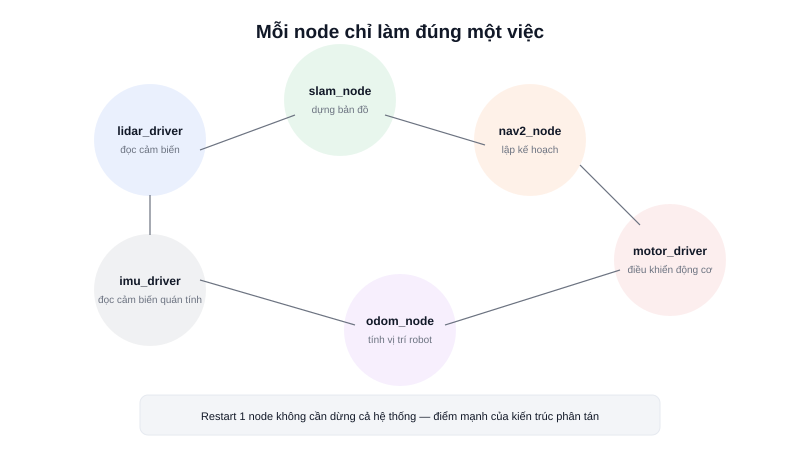

Nếu package là "đơn vị đóng gói mã nguồn" thì **node** là "đơn vị đang chạy" — một tiến trình thực thi cụ thể, làm đúng một nhiệm vụ trong toàn hệ thống robot: đọc dữ liệu từ một cảm biến, chạy thuật toán SLAM, hay gửi lệnh xuống động cơ.



## Khái niệm chính

Một node là một chương trình (thường viết bằng Python hoặc C++) khởi tạo kết nối với ROS2, đăng ký các publisher/subscriber/service mà nó cần, rồi chạy vòng lặp chờ sự kiện (**spin**) để xử lý dữ liệu đến. Triết lý thiết kế ROS2 khuyến khích **mỗi node chỉ làm một việc** (Unix philosophy: "do one thing well") — thay vì viết một chương trình khổng lồ làm tất cả, tách thành nhiều node nhỏ, dễ debug, dễ thay thế độc lập, và có thể tái sử dụng ở dự án khác.

Một robot AMR thực tế có thể chạy đồng thời: node driver LiDAR, node driver IMU, node tính odometry, node SLAM, node Nav2 (thực ra tự nó cũng là nhiều node con), node điều khiển động cơ — mỗi node là một tiến trình riêng biệt, có thể restart node này mà không ảnh hưởng node khác.

> **Tóm lại:** Node không "chứa" ROS2 — nó chỉ dùng thư viện client ROS2 (`rclpy`/`rclcpp`) để tham gia vào ROS graph, giống như một chương trình bình thường import một thư viện để dùng.

## Nguyên lý hoạt động

Một node Python tối thiểu — chỉ khởi tạo và "sống" cho tới khi bị dừng (Ctrl+C):

```python
import rclpy
from rclpy.node import Node

class MinimalNode(Node):
    def __init__(self):
        super().__init__('minimal_node')   # tên node hiển thị trong ROS graph
        self.get_logger().info('Node đã khởi động')

def main():
    rclpy.init()
    node = MinimalNode()
    rclpy.spin(node)      # vòng lặp chính — chờ và xử lý sự kiện (message đến, timer...)
    rclpy.shutdown()

if __name__ == '__main__':
    main()
```

`rclpy.spin(node)` là dòng quan trọng nhất — nó giữ tiến trình sống và liên tục kiểm tra có sự kiện nào cần xử lý không (message mới trên topic đã subscribe, timer tới hạn, request service đến...). Không gọi `spin()` thì node khởi tạo xong sẽ thoát ngay lập tức, không kịp nhận bất kỳ dữ liệu nào.

Kiểm tra các node đang chạy bằng:

```bash
ros2 node list          # liệt kê mọi node đang hoạt động
ros2 node info /minimal_node   # xem node đang publish/subscribe topic nào
```
