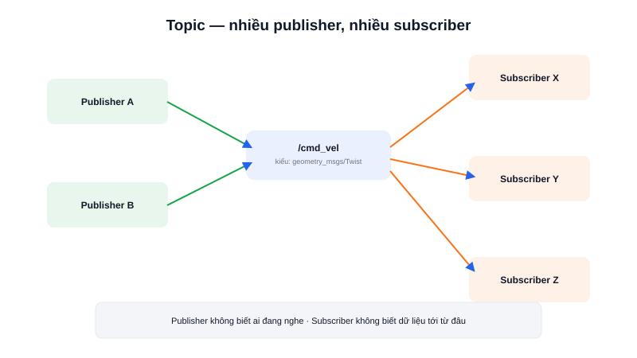

Đọc dữ liệu LiDAR 10 lần mỗi giây, gửi vận tốc điều khiển động cơ liên tục, phát trạng thái pin định kỳ — đây đều là những luồng dữ liệu **liên tục, lặp lại**, khác hẳn kiểu "yêu cầu rồi chờ một câu trả lời duy nhất". **Topic** chính là cơ chế ROS2 dành riêng cho kiểu dữ liệu này.



## Khái niệm chính

Topic là một **kênh có tên**, mang một **kiểu dữ liệu (message type)** cố định. Node muốn gửi dữ liệu tạo một **Publisher** gắn với topic đó; node muốn nhận dữ liệu tạo một **Subscriber** cũng gắn với đúng topic và kiểu dữ liệu đó. Cả hai bên **không cần biết về nhau** — publisher cứ gửi, không quan tâm có ai đang nghe hay không; subscriber cứ nhận, không quan tâm dữ liệu tới từ node nào.

### Nhiều-nhiều (many-to-many), không phải một-một

Một topic có thể có **nhiều publisher** cùng gửi vào và **nhiều subscriber** cùng nhận — ví dụ, hai node camera khác nhau đều publish ảnh lên cùng một topic `/image`, và ba node khác nhau (một để hiển thị, một để lưu file, một để nhận diện vật thể) cùng subscribe topic đó, mỗi node nhận được đầy đủ mọi message publish lên.

> **Tóm lại:** Topic phù hợp cho dữ liệu chảy liên tục, không cần phản hồi trực tiếp (fire-and-forget) — publisher không bao giờ biết chắc subscriber đã nhận được hay chưa. Khi cần một yêu cầu-một câu trả lời rõ ràng, đó là lúc dùng **Service** thay vì Topic.

## Nguyên lý hoạt động

```text
Publisher A ──┐
              ├──►  /cmd_vel (topic, kiểu Twist)  ──┬──► Subscriber X
Publisher B ──┘                                      └──► Subscriber Y
```

Quan sát và tương tác với topic trực tiếp từ dòng lệnh, không cần viết code:

```bash
ros2 topic list                    # liệt kê mọi topic đang hoạt động
ros2 topic echo /cmd_vel           # in ra màn hình mọi message đang chảy qua topic
ros2 topic hz /scan                # đo tần suất publish thực tế (Hz)
ros2 topic pub /cmd_vel geometry_msgs/msg/Twist "{linear: {x: 0.2}}"  # tự publish thử
```

`ros2 topic echo` là công cụ debug được dùng nhiều nhất khi mới học ROS2 — muốn biết một node có đang thực sự gửi dữ liệu đúng như mong đợi hay không, chỉ cần echo trực tiếp topic đó mà không cần viết bất kỳ dòng code nào.
