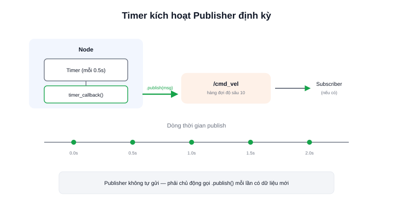

Một node muốn "nói" ra dữ liệu — vị trí robot, ảnh camera, trạng thái pin — cần tạo ra một **Publisher**: đối tượng đại diện cho quyền gửi dữ liệu lên một topic cụ thể.



## Khái niệm chính

Publisher được tạo bên trong một node, gắn với **tên topic** và **kiểu message** cố định. Sau khi tạo, node chỉ cần gọi `.publish(msg)` bất cứ khi nào có dữ liệu mới cần gửi — thường đặt trong một hàm chạy định kỳ nhờ **Timer** của ROS2 (ví dụ publish mỗi 0,1 giây = tần suất 10Hz).

Publisher **không chờ phản hồi**, không biết có subscriber nào đang lắng nghe hay không — nó chỉ đẩy dữ liệu vào hệ thống, giao cho DDS bên dưới lo việc chuyển tới các subscriber đã đăng ký (xem thêm bài Topic và DDS).

> **Tóm lại:** Tạo publisher không đồng nghĩa dữ liệu sẽ tự động được gửi — phải chủ động gọi `.publish()` mỗi lần có dữ liệu mới, thường thông qua một Timer chạy đều đặn.

## Nguyên lý hoạt động

Publisher tối thiểu trong một node Python, gửi vận tốc cố định mỗi 0,5 giây:

```python
import rclpy
from rclpy.node import Node
from geometry_msgs.msg import Twist

class VelocityPublisher(Node):
    def __init__(self):
        super().__init__('velocity_publisher')
        self.publisher_ = self.create_publisher(Twist, '/cmd_vel', 10)  # 10 = độ sâu hàng đợi (QoS)
        self.timer = self.create_timer(0.5, self.timer_callback)        # gọi lại mỗi 0.5s

    def timer_callback(self):
        msg = Twist()
        msg.linear.x = 0.2   # 0.2 m/s tiến thẳng
        self.publisher_.publish(msg)
        self.get_logger().info(f'Đã gửi: linear.x = {msg.linear.x}')
```

Tham số `10` trong `create_publisher(Twist, '/cmd_vel', 10)` là độ sâu hàng đợi tin nhắn (một phần của QoS — Quality of Service, xem bài riêng) — số lượng message tối đa được giữ trong bộ đệm nếu bên nhận xử lý chưa kịp. Kiểm tra publisher đang hoạt động bằng `ros2 topic echo /cmd_vel` ở một terminal khác trong lúc node đang chạy.
